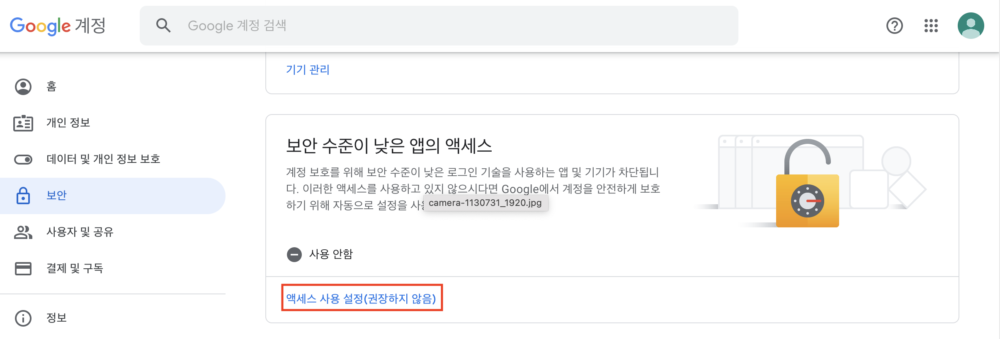
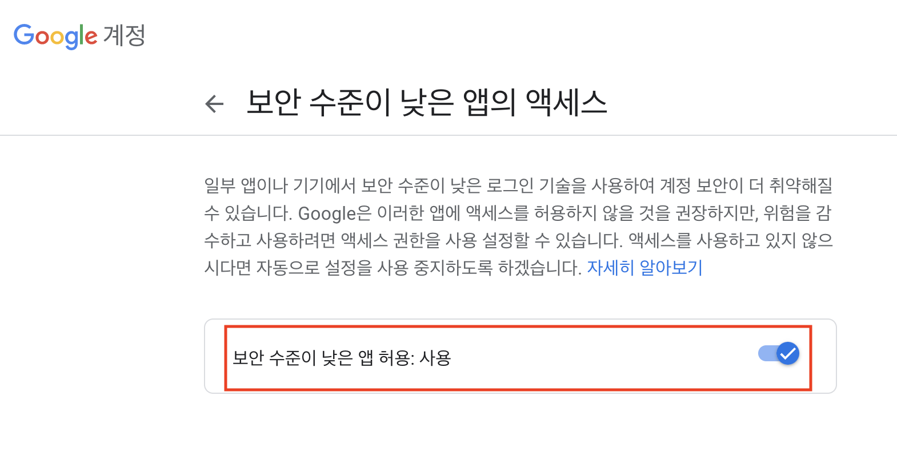
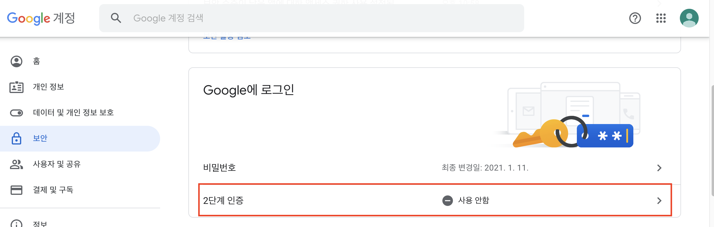
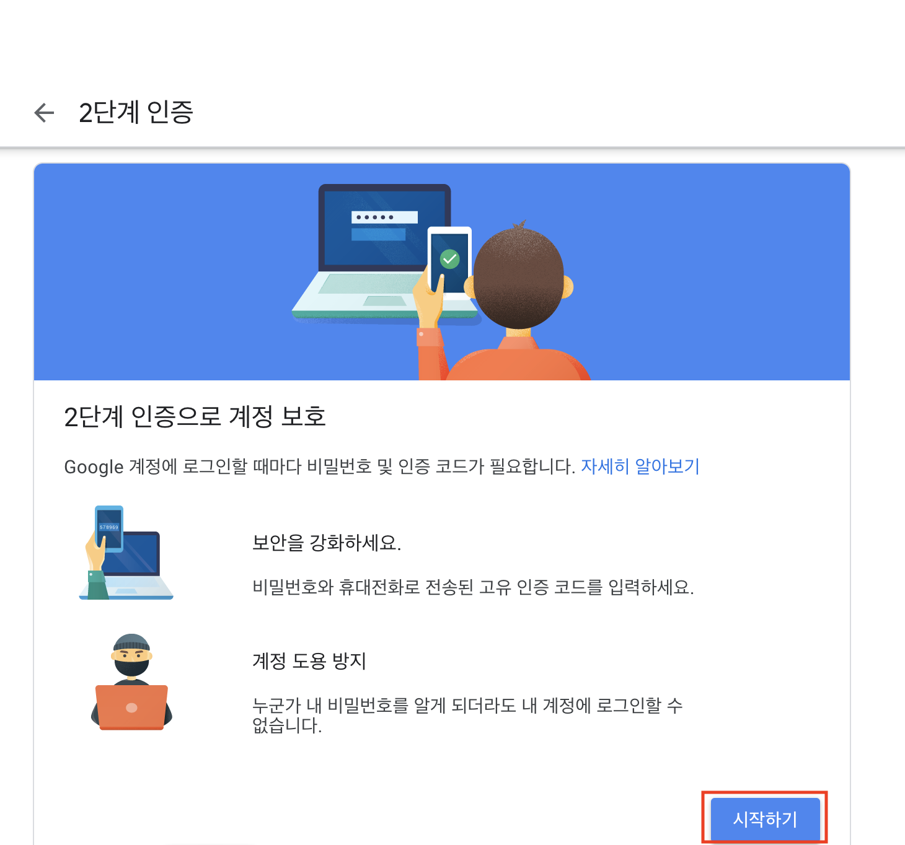
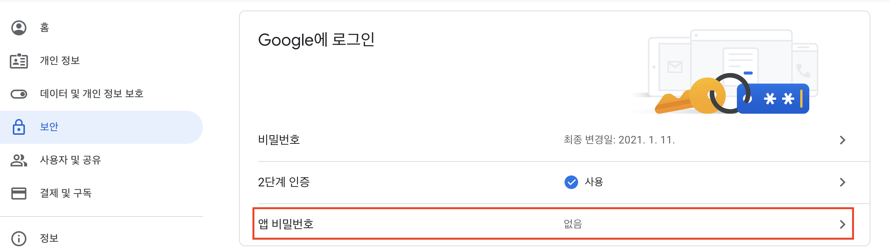
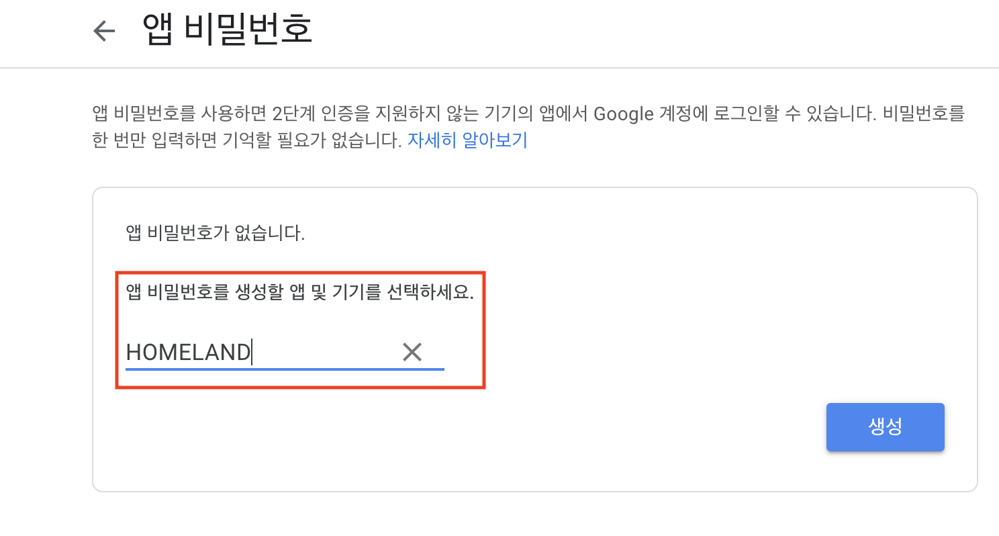
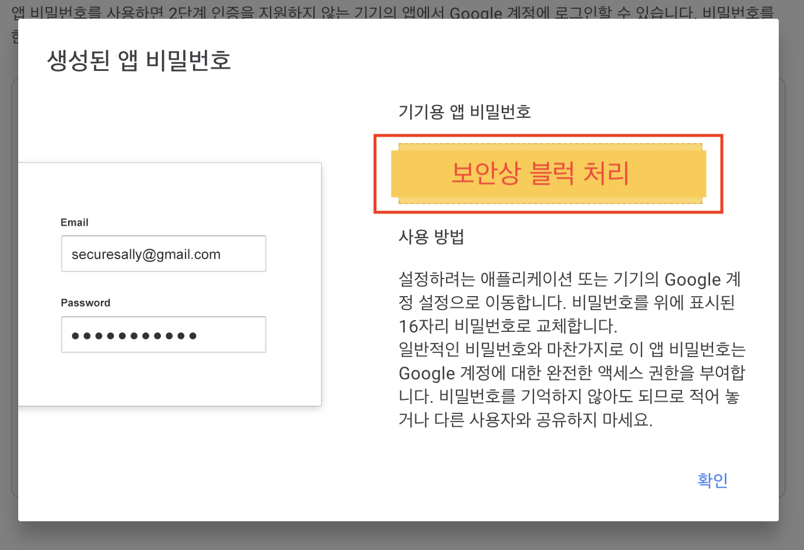

#  외부 서비스 정보 정리

### 비밀번호 찾기에 이용되는 구글 계정으로 이메일 보내기

1. #### 보안이 낮은 앱 허용하기

   - 엑세스 사용 설정 클릭하기

   

   

   

   - 보안 수준이 낮은 앱 허용을 사용으로 설정하기




2. #### 2단계 인증 설정하기

   - 2단계 인증 클릭하기

     

   

   

   - 2단계 인증을 위한 휴대전화 인증 진행하기

     

     

     

3. #### 2단계 인증 사용 후 앱 비밀번호 설정하기

   - 앱 비밀번호 클릭하기

     

   

   

   - 앱 비밀번호를 생성할 앱 선택하기

     

     

   - 생성된 앱 비밀번호 적어두기

     

​	

​	

4. `application.properties` 에 google 계정 등록하기

   ```python
   ## Email Send Configuration_SMTP
   spring.mail.host=smtp.gmail.com
   spring.mail.port=587
   spring.mail.username= 구글 계정 이름
   spring.mail.password= 발급 받은 앱 비밀번호
   spring.mail.properties.mail.smtp.auth=true
   spring.mail.properties.mail.smtp.starttls.enable=true
   ```

   
