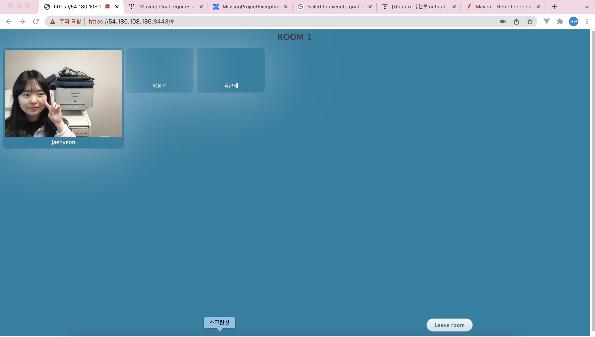

1. **AWS 에서 우분투로 서버 만들기**

2. **AWS 환경에서 Doker 설치하기**

   ```
   $ sudo apt-get update
   
   $ sudo apt-get install \
       ca-certificates \
       curl \
       gnupg \
       lsb-release
       
   $ echo \
     "deb [arch=$(dpkg --print-architecture) signed-by=/usr/share/keyrings/docker-archive-keyring.gpg] https://download.docker.com/linux/ubuntu \
     $(lsb_release -cs) stable" | sudo tee /etc/apt/sources.list.d/docker.list > /dev/null
     
   $ sudo apt-get update
   
   $ sudo apt-get install docker-ce docker-ce-cli containerd.io
   
   $ sudo curl -L "https://github.com/docker/compose/releases/download/1.29.2/docker-compose-$(uname -s)-$(uname -m)" -o /usr/local/bin/docker-compose
   
   $ sudo chmod +x /usr/local/bin/docker-compose
   
   ```

3. **Kurento 실행**

   ```
   $ docker pull kurento/kurento-media-server:latest
   
   $ docker run -d --name kms --network host \
       kurento/kurento-media-server:latest
   ```

4. **STUN / TURN 서버 설치**

   1) 인바운드 포트 허용

      - AWS에서 보안 -> 인바운드 규칙 편집 -> UDP, TCP 모든 포트 허용

   2) Coturn 설치

      ```
      $ sudo apt-get update && sudo apt-get install --no-install-recommends --yes coturn
      ```

   3. Coturn 설정

      VS Code에서 Open folder /etc/로 연 다음,

      root 권한으로 변경해준 다음, 

      ```
      $ sudo su
      ```

      /etc/default/coturn 파일을 수정

      ```
      TURNSERVER_ENABLED=1
      ```

      /etc/turnserver.conf 파일을 수정

      

    4. Coturn 재가동

       ```
       $ sudo service coturn restart
       ```

5. **Kurento의 STUN / TURN 서버 설정**

   : Kurento 미디어 서버가 STUN/TURN 서버와 같이 작동하기 위해  STUN/TURN 서버의 위치를 설정한다. 

   1. Kurento Docker 컨테이너 접속

      ```
      $ docker ps -a # 실행중인 컨테이너 ID 확인
      $ docker exec -it <컨테이너 ID> /bin/bash
      ```

      : `root@docker-desktop:/# ` 으로 컨테이너 터미널이 접속됨

     2. Kurento WebRtcEndPoint.ini 수정

        ```
        root@docker-desktop:/# vi /etc/kurento/modules/kurento/WebRtcEndpoint.conf.ini
        ```

        vi editor 사용법을 통해 아래 부분 수정 (;; 이건 주석이니 지울 것)

        

        만약에 vim이 설치 안되어 있으면

        ```
        $ apt-get update
        $ apt-get install vim
        ```

6. **Tutorial에서 Get Start** 

   ```
   $ git clone https://github.com/Kurento/kurento-tutorial-java.git
   $ cd kurento-tutorial-java/kurento-hello-world
   $ git checkout master
   ```

   

7. **HTTPS 활성화**

   1. Self-Signed 인증서 생성

      - VS Code를 다시 껐다가 open file -> /home/ubuntu 를 열어서 

      cd ~ , cd src/main/resources 까지 들어감

      - keystore 폴더 만들기

        ```
        mkdir keystore
        ```

      - keystore 폴더로 들어간 다음(`cd keystore`) 명령어로 sassy.p12 파일 생성 

        ```
        $ keytool -genkeypair -alias ssafy -keyalg RSA -keysize 2048 -storetype PKCS12 -keystore ssafy.p12 -validity 3650
        ```

        

   2. Application.properties 설정

      - kurento를 실행해서 target 폴더가 생기게 한다.

      ```
      mvn -U clean spring-boot:run -Dspring-boot.run.jvmArguments="-Dkms.url=ws://localhost:8888/kurento"
      ```

      - kureto-hello-world -> target -> classes 에 있는 application.properties 파일을 수정해준다.

      ```
      # ===================================================================
      # Spring Boot application properties
      #
      # For a list of common properties, check the Spring Boot docs:
      # https://docs.spring.io/spring-boot/docs/current/reference/html/appendix-application-properties.html
      # ===================================================================
      
      
      # ----------------------------------------
      # CORE PROPERTIES
      # ----------------------------------------
      
      # BANNER
      banner.location=classpath:banner.txt
      
      # LOGGING
      logging.level.root=INFO
      logging.level.org.apache=WARN
      logging.level.org.springframework=WARN
      logging.level.org.springframework.boot.devtools=INFO
      logging.level.org.kurento=INFO
      logging.level.org.kurento.tutorial=INFO
      
      # OUTPUT
      # Terminal color output; one of [ALWAYS, DETECT, NEVER]
      spring.output.ansi.enabled=DETECT
      
      
      # ----------------------------------------
      # WEB PROPERTIES
      # ----------------------------------------
      
      # EMBEDDED SERVER CONFIGURATION
      # server.port=8443
      # server.ssl.key-store=classpath:keystore.jks
      # server.ssl.key-store-password=kurento
      # server.ssl.key-store-type=JKS
      # server.ssl.key-alias=kurento-selfsigned
      
      server.port=8443
      server.http.port=8080
      server.ssl.enabled=true
      server.ssl.key-store-type=PKCS12
      server.ssl.key-store=classpath:keystore/ssafy.p12
      server.ssl.key-store-password=설정한 비밀번호
      server.ssl.key-alias=ssafy
      trust.store=classpath:keystore/ssafy.p12
      trust.store.password=설정한 비밀번호
      
      ```

       

8. **실행해보기!**

   ```
   mvn -U clean spring-boot:run -Dspring-boot.run.jvmArguments="-Dkms.url=ws://localhost:8888/kurento"
   ```

   접속할 URL : `https://<퍼블릭 IPv4 주소>:8443/ ` 


### 실행 결과 화면 (220112)

 1. Kurento-hello-world

    

2. kurento-group-call

   

​	