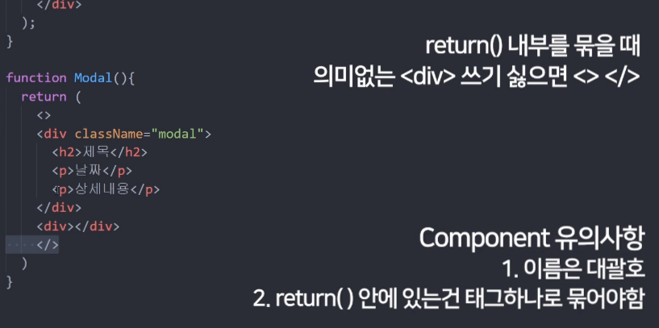
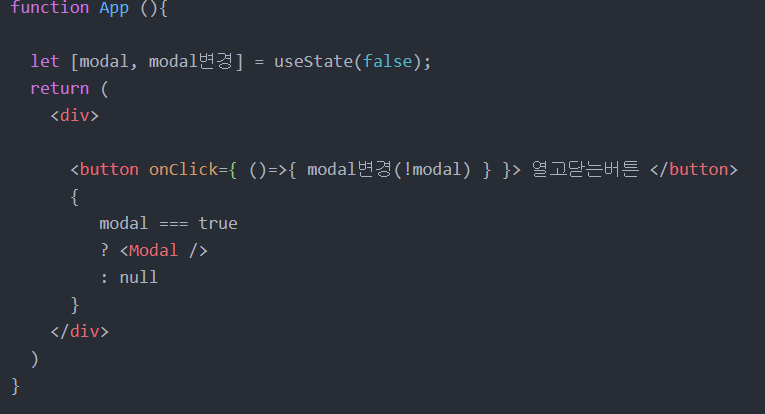

## 5강 state값 변경하기

##### tip-1

노란색 warning 문구는 에러가 아님
코드를 클린하게 쓰도록 권장하기 위해 뜨는 경고
보기 싫으면

```javascript
/* eslint-disable */
```

코드를 제일 상단에 쓰면 됨

##### tip-2

브라우저 검색창에 우클릭 후 그림 이모티콘을 가져와서 jsx에서 쓰기 가능! (ex: 따봉 버튼)


state 변경하기

```javascript
 const [따봉, 따봉변경] = useState(0);

<div className="list">
        <h3>{ 글제목[0] } <span onClick={ ()=> { 따봉변경 (따봉 + 1)} }>👍</span> { 따봉 } </h3>
        <p>2월 17일 발행</p>
        <hr/>
      </div>
            
```

따봉의 초깃값은 0이고
onclick 함수에 따봉변경 함수를 통해 버튼을 클릭할 때 마다 값이 +1 됨 (새로고침 없이!!!)


## 6강 deep copy

버튼 클릭 시 '남자코트추천' 을 '여자코트추천'으로 바꾸고 싶을 때!

```javascript
import React, { useState } from 'react';
import './App.css';

function App() {
  const [글제목, 글제목변경] = useState(['남자 코트 추천', '강남 우동 맛집']);
  function 제목바꾸기 (){
    var newArray = [...글제목];
    newArray[0] = '여자코트추천'
    글제목변경( newArray );
  }
    	
여기서 ...은 deepcopy를 의미함
deep copy: 값공유X, 서로 독립적인 값을 가지는 복사

```


## 7강 Component : react를 쓰는 가장 큰 이유!



div 여러개 쓰고 싶으면
가장 큰 div 안에 여러 div를 넣으면 됨!

div 여러개 쓰고 싶은데 의미 없는 div로 묶기 싫으면
가장 상단에 <> </>로 묶고 시작해주면 됨!

component라는 HTML을 한 단어로 축약해서 쓸 수 있는 가장 큰 장점!

관습적으로 component 명의 첫 글자는 대문자!

아래 function을 통해 component를 만들어주고 위에서 쓸 때는

`<Modal/>` 을 통해 호출함


##### Component로 만들면 좋은것들

1. 반복 출현하는 HTML 덩어리들
2. 자주 변경되는 HTML UI들
3. 다른 페이지 만들 때도 컴포넌트로 만듦

##### 단점

1. state 쓸 때 복잡해짐 (state는 function안에서만 유효하기 때문에 다른 component에 쓰려면 
   쓰고 싶은 component로 props를  통해 state를 전달해줘야 함)


## 8강 삼항연산자를 통해 클릭하면 동작하는 UI (모달창) 만들기


숙제 모범 답안



내 답안

```javascript
<button onClick={ 
        modal === true
        ? ()=>{ modal변경(false) }
        : ()=>{ modal변경(true) }
      }>버튼</button>
      {
        modal === true
        ? <Modal></Modal>
        : null
      }
```


