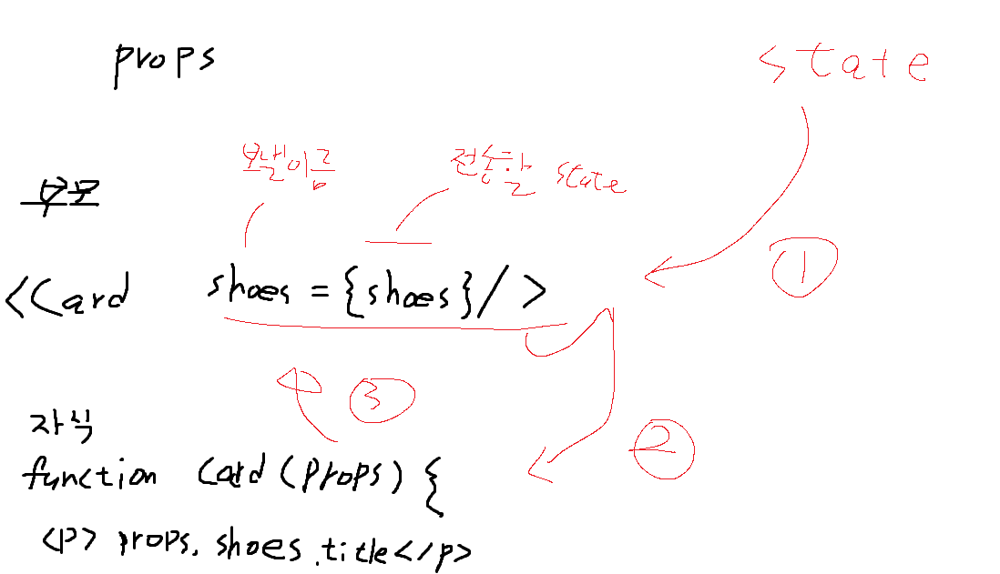

## React Study

## 9강 map

```javascript
{
        글제목.map((글)=> {
          return <div className='list'>
            <h3>{ 글 }</h3>
            <p>2월 18일 발행</p>
            <hr></hr>
          </div>
        })
      }
```


## 10~11강 props

App은 부모 컴포넌트
Modal은 자식 컴포넌트

props로 자식에게 state 전해주는 법

1. 부모 컴포넌트에서 자식컴포넌트를 쓸 때
   <자식컴포넌트 작명={state명}/>

2. 자식컴포넌트에서 props 파라미터 입력 후 사용

   ```javascript
   const [누른제목, 누른제목변경] = useState(0);
   
   {
       글제목.map((글, i)=> {
         return <div className='list' key={i}>
           <h3 onClick={ ()=> { 누른제목변경(i) } }> { 글 } </h3>
       <p>2월 18일 발행</p>
       <hr></hr>
       </div>
       })	
      }
         
   function Modal(props){
     return(
       <div className="modal">
         <h2>{props.글제목[props.누른제목]}</h2>
         <p>날짜</p>
         <p>상세내용</p>
       </div>
     )
   
   ```




## 11강~ 12강 

```javascript
<div className="publish">
      <input onChange={ (e)=>{ 입력값변경(e.target.value) } } />
        <button onClick={ ()=>{ 
          const newArray = [...글제목]
          newArray.unshift(입력값)
          글제목변경(newArray)
         } }>저장</button>
      </div>
```

`<input onChange={ (e)=>{ 입력값변경(e.target.value) } }></input>`
변화가 일어날 때 마다 state의 값을 변경해줌
변경된 state값을 버튼을 통해 글제목에 추가 저장