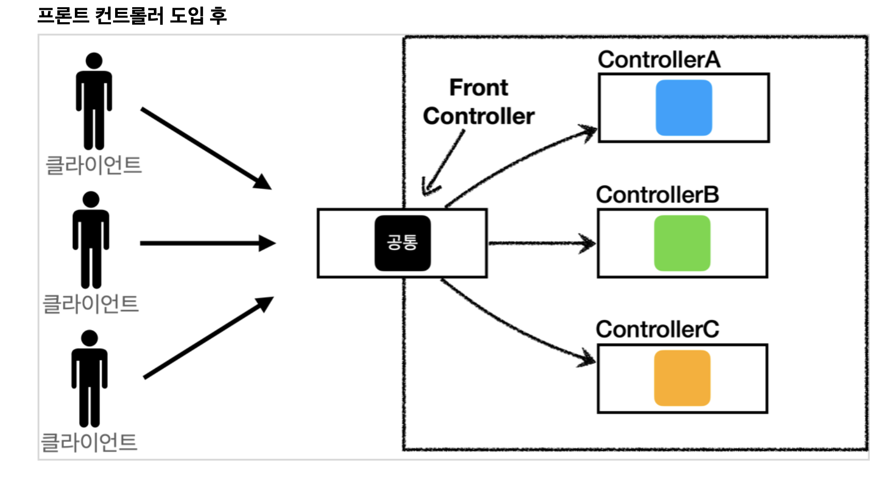
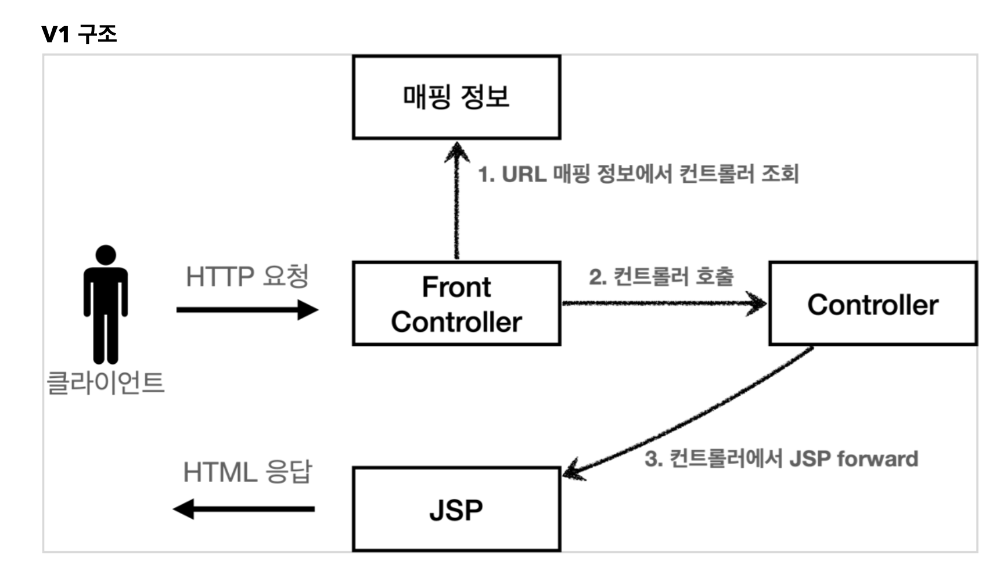
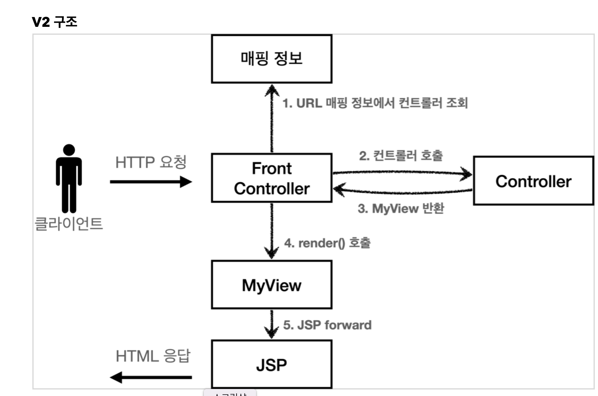
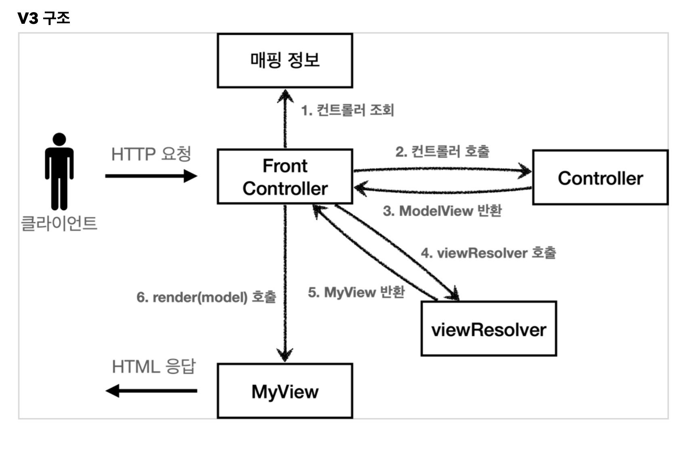

## MVC 패턴 - 한계

MVC 패턴을 적용한 덕분에 컨트롤러의 역할과 뷰를 렌더링 하는 역할을 명확하게 구분할 수 있다.
 특히 뷰는 화면을 그리는 역할에 충실한 덕분에, 코드가 깔끔하고 직관적이다. 단순하게 모델에서 필요한 데이터를 꺼내고, 화면을 만들면 된다.
 그런데 컨트롤러는 딱 봐도 중복이 많고, 필요하지 않는 코드들도 많이 보인다.

### **MVC** **컨트롤러의 단점**

**포워드 중복**

View로 이동하는 코드가 항상 중복 호출되어야 한다. 물론 이 부분을 메서드로 공통화해도 되지만, 해당 메서드도 항상 직접 호출해야 한다.

```java
RequestDispatcher dispatcher = request.getRequestDispatcher(viewPath);
dispatcher.forward(request, response);
```


**ViewPath에 중복**

```
String viewPath = "/WEB-INF/views/new-form.jsp";
```

prefix: /WEB-INF/views/
 suffix: .jsp
 그리고 만약 jsp가 아닌 thymeleaf 같은 다른 뷰로 변경한다면 전체 코드를 다 변경해야 한다.

**사용하지 않는 코드**

다음 코드를 사용할 때도 있고, 사용하지 않을 때도 있다. 특히 response는 현재 코드에서 사용되지 않는다.

```
HttpServletRequest request, HttpServletResponse response
```

그리고 이런 HttpServletRequest , HttpServletResponse 를 사용하는 코드는 테스트 케이스를 작성하기도 어렵다.

**공통 처리가 어렵다****.
** 기능이 복잡해질 수 록 컨트롤러에서 공통으로 처리해야 하는 부분이 점점 더 많이 증가할 것이다. 단순히 공통 기능을 메서드로 뽑으면 될 것 같지만, 결과적으로 해당 메서드를 항상 호출해야 하고, 실수로 호출하지 않으면 문제가 될 것이다. 그리고 호출하는 것 자체도 중복이다.

**정리하면 공통 처리가 어렵다는 문제가 있다****.
** 이 문제를 해결하려면 컨트롤러 호출 전에 먼저 공통 기능을 처리해야 한다. 소위 **수문장 역할**을 하는 기능이 필요하다. **프론트 컨트롤러****(Front Controller)** **패턴**을 도입하면 이런 문제를 깔끔하게 해결할 수 있다. (입구를 하나로!)
 스프링 MVC의 핵심도 바로 이 프론트 컨트롤러에 있다.


##  MVC 프레임워크 만들기




#### **FrontController 패턴 특징**

- 프론트 컨트롤러 서블릿 하나로 클라이언트의 요청을 받음

- 프론트 컨트롤러가 요청에 맞는 컨트롤러를 찾아서 호출 

- 입구를 하나로!

- 공통 처리 가능
-  프론트 컨트롤러를 제외한 나머지 컨트롤러는 서블릿을 사용하지 않아도 됨

#### **스프링 웹 MVC와 프론트 컨트롤러**

* 스프링 웹 MVC의 핵심도 바로 FrontController
* 스프링 웹 MVC의 DispatcherServlet이 FrontController 패턴으로 구현되어 있음


## **프론트 컨트롤러 도입 - v1**

프론트 컨트롤러를 단계적으로 도입해보자.
 이번 목표는 기존 코드를 최대한 유지하면서, 프론트 컨트롤러를 도입하는 것이다. 먼저 구조를 맞추어두고 점진적으로 리펙터링 해보자.



#### **프론트 컨트롤러 분석**

**urlPatterns**

urlPatterns = "/front-controller/v1/*" : /front-controller/v1 를 포함한 하위 모든 요청은 이 서블릿에서 받아들인다.
 예) /front-controller/v1 , /front-controller/v1/a , /front-controller/v1/a/b

**controllerMap**

key: 매핑 URL
 value: 호출될 컨트롤러

**service()**

먼저 requestURI 를 조회해서 실제 호출할 컨트롤러를 controllerMap 에서 찾는다. 만약 없다면 404(SC_NOT_FOUND) 상태 코드를 반환한다.
 컨트롤러를 찾고 controller.process(request, response); 을 호출해서 해당 컨트롤러를 실행한다.

**JSP**

JSP는 이전 MVC에서 사용했던 것을 그대로 사용한다.


## View 분리 - v2

모든 컨트롤러에서 뷰로 이동하는 부분에 중복이 있고, 깔끔하지 않다.

이 부분을 깔끔하게 분리하기 위해 별도로 뷰를 처리하는 객체를 만들자.




## Model 추가 - v3

**서블릿 종속성 제거**

컨트롤러 입장에서 HttpServletRequest, HttpServletResponse이 꼭 필요할까?
 요청 파라미터 정보는 자바의 Map으로 대신 넘기도록 하면 지금 구조에서는 컨트롤러가 서블릿 기술을 몰라도 동작할 수 있다.
 그리고 request 객체를 Model로 사용하는 대신에 별도의 Model 객체를 만들어서 반환하면 된다. 우리가 구현하는 컨트롤러가 서블릿 기술을 전혀 사용하지 않도록 변경해보자.
 이렇게 하면 구현 코드도 매우 단순해지고, 테스트 코드 작성이 쉽다.

**뷰 이름 중복 제거**

컨트롤러에서 지정하는 뷰 이름에 중복이 있는 것을 확인할 수 있다.
 컨트롤러는 **뷰의 논리 이름**을 반환하고, 실제 물리 위치의 이름은 프론트 컨트롤러에서 처리하도록 단순화 하자.
 이렇게 해두면 향후 뷰의 폴더 위치가 함께 이동해도 프론트 컨트롤러만 고치면 된다.

/WEB-INF/views/new-form.jsp --> **new-form** 

/WEB-INF/views/save-result.jsp --> **save-result** 

/WEB-INF/views/members.jsp -->  **members**

