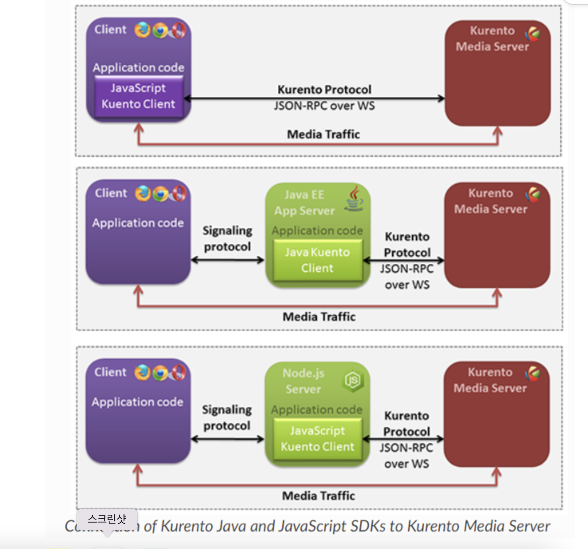

# Swagger

Swagger가 필요한 이유

- 백엔드 개발자와 프론트엔트 개발자의 소통 도구
- 개발자는 인터페이스로 소통
- API 정의, 공유, Test, 문서화에 적합한 도구
- 협업이나 원격 근무 환경에서 프로젝트 수행 가능
- Interface 정의가 명확했다면 각자의 몫을 만들면 완성

# Kurento

각 방은 다른 방과 격리된 자체 파이프라인을 생성합니다. 특정 방에 접속한 클라이언트는 같은 방에 있는 클라이언트와만 미디어를 교환할 수 있습니다.

각 클라이언트는 자체 미디어를 보내고 차례로 다른 모든 참가자로부터 미디어를 받습니다. 이는 각 방에 총 n*n개의 webrtc 엔드포인트가 있음을 의미합니다. 여기서 n은 클라이언트 수입니다.

새 클라이언트가 방에 들어오면 새 webrtc가 생성되고 서버에서 미디어를 수신하도록 협상됩니다. 반면에 모든 참가자는 새 사용자가 연결되었음을 알립니다. 그런 다음 모든 참가자는 서버에 새 참가자의 미디어를 수신하도록 요청합니다.

새로 온 사람은 차례로 연결된 모든 참가자의 목록을 가져오고 서버에 방에 있는 모든 현재 클라이언트로부터 미디어를 수신하도록 요청합니다.

클라이언트가 방을 나갈 때 모든 클라이언트는 서버에서 알립니다. 그런 다음 클라이언트 측 코드는 서버에 남아 있는 클라이언트와 관련된 모든 미디어 요소를 취소하도록 요청합니다.

이것은 웹 애플리케이션이므로 클라이언트-서버 아키텍처를 따릅니다. . **서버 측에서는 Kurento Media Server** 기능 을 제어하기 위해 **Kurento Java Client** API를 사용하는 Spring-Boot 기반 애플리케이션 서버를 사용 합니다. 대체로 이 데모의 상위 수준 아키텍처는 3계층입니다. 이러한 엔터티를 통신하기 위해 두 개의 WebSocket이 사용됩니다. 먼저 클라이언트와 응용 프로그램 서버 사이에 WebSocket을 만들어 사용자 지정 신호 프로토콜을 구현합니다. 둘째, 다른 WebSocket을 사용하여 Kurento Java 클라이언트와 Kurento Media Server 간의 통신을 수행합니다. 이 통신은 **Kurento 프로토콜 을 사용하여 이루어집니다**

### GroupCallApp

 *KurentoClient* 는 이 클래스에서 Spring Bean으로 인스턴스화됩니다. 이 빈은 애플리케이션에 미디어 기능을 추가하는 데 사용되는 **Kurento 미디어 파이프라인 을 만드는 데 사용됩니다.** 이 인스턴스화에서 Kurento Media Server의 위치를 클라이언트 라이브러리에 지정해야 함을 알 수 있습니다.

bean의 종류

UserRegistry, RomManager, CallHandler, KurentoClient, 

### CallHandler

중심 메서드 : `handleTextMessage` 이 메서드는 웹소켓의 요청에 대한 작업을 구현하고 웹 소켓을 통해 응답을 반환한다. 즉 시그널링 프로토콜의 서버 부분을 구현

응용 프로그램 서버로 들어오는 메세지의 종류가 joinRoom, receiveVideoFrom, leaveRoom및 onIceCandidate임

1. joinRoom 일때, 서버는 지정된 이름으로 등록된 방이 있는지 확인하고 이 방에 사용자를 추가하고 사용자를 등록

2. recieveVideoForm에서 sdp는 세션 기술 프로토콜을 의미한다. 이는 스트리밍 미디어의 초기화 인수를 기술하기 위한 포멧림

3. leaveRoom일 때는 한 사용자의 화상 통화를 종료한다

4. onIceCandidate는 RTCIceCandidate 인터페이스를 구현한다. 이때 RTCIceCandidate 인터페이스는[WebRTC API의 한 종류로서, RTCPeerConnection을 구축 할 때 사용되기도하는 Internet Connectivity Establishment ICE의 후보군 (candidate)를 말합니다. 하나의 ICE candidate는 WebRTC가 원격 장치와 통신을 하기 위해 요구되는 프로토콜과 라우팅에 대해 알려줍니다. WebRTC 피어 연결을 처음 시작하게되면, 일반적으로 여러개의 candiate들이 연결의 각 end에 의해 만들어집니다. 그리고 이 과정은 로컬 유저와 원격 유저가 연결을 위해 최고의 방법을 서로의 동의하에 선택하기 전까지 계속 됩니다. 이후에 WebRTC가 선택한 candidate를 사용해서 연결을 시도하게됩니다. 

   파라미터 3가지

   - `candidate`연결성 확인을 위해 사용 될 수 있는 candidate에 대한 전달 주소를 나타내는 `DOMString`입니다. 이 주소의 형식은 RFC 5245에 정의된바와 같이 `candidate-attribute` 입니다. `RTCIceCandidate`가 "마지막 candidate"를 알려주면, 이 문자열은 빈 문자열 (`""`)이 됩니다.

   - `sdpMid` (en-US) : candidate의 미디어 스트림 식별 태그를 정의하는 `DOMString`입니다. 여기서 식별 태그는 candidate와 연관이 있는 컴포넌트안의 미디어 스트림을 유일하게 식별합니다. candidate와 관련이 있는 미디어 스트림이 존재하지 않으면, 이 값은 `null `입니다.

   - `sdpMLineIndex` (en-US) : 이 값이 `null`이 아니라면, `sdpMLineIndex`는 candidate와 연관 된 SDP 의 미디어 설명에 대한, 0을 기준으로 하는 색인 번호를 알려줍니다 RFC 에 정의되어 있습니다.. 

### Room

- getName : 방의 이름을 return 한다
- Room: 생성자로 roomName과 그 방에 해당하는 pipeline을 생성한다
- shutdown: close() 를 이용해 방을 닫는다
- leave: 파라미터로 들어온 user가 방을 나가고, removeParticipant와 close()를 실행한다.
- joinRoom: newPaticipantMsgd에 들어온 사용자의 이름을 담아서 원래 있던 participant에게 sendMessage를 한다. 그리고 새로운 참가자를 participantsList에 add한다.
- removeParticipant: participants가 나갔다고 남겨준 사람들에게 메세지를 보내고 예외 처리로 인해 unnotified된 사용자들도 체크한다
- sendParticipantNames: 요청한 사용자에게 자신을 제외한 나머지의 participants의 이름을 전송한다.
- getParticipants: participants.values()
- close: for문으로 각 유저마다 user.close()를 실행한다.

### RoomManager : 

- getRoom: 파라미터로 roomName이 주어지면 활성화된 rooms에서 찾아서 만약 없으면 create now 하고 있으면 그 room을 반환한다.
- removeRoom: room.close()

### UserRegistry

- register
- getByName
- getBySession
- removeBySession

### UserSession

변수

- name
- session
- pipeline
- roomName
- outgoingMedia
- incomingMedia

함수

- UserSession : 생성자 
- getOutgoingWebRtcPeer
- receiveVideoFrom(UserSession sender, String sdpOffer)
- getEndpointForUser(final UserSession sender)
- cancelVideoFrom(final UserSession sender)
- cancelVideoFrom(final String senderName)
- close()
-  sendMessage(JsonObject message)
- addCandidate(IceCandidate candidate, String name)
- equals(Object obj)
- hashCode()

Kurento API 참고 링크: https://doc-kurento.readthedocs.io/en/stable/_static/client-javadoc/index.html