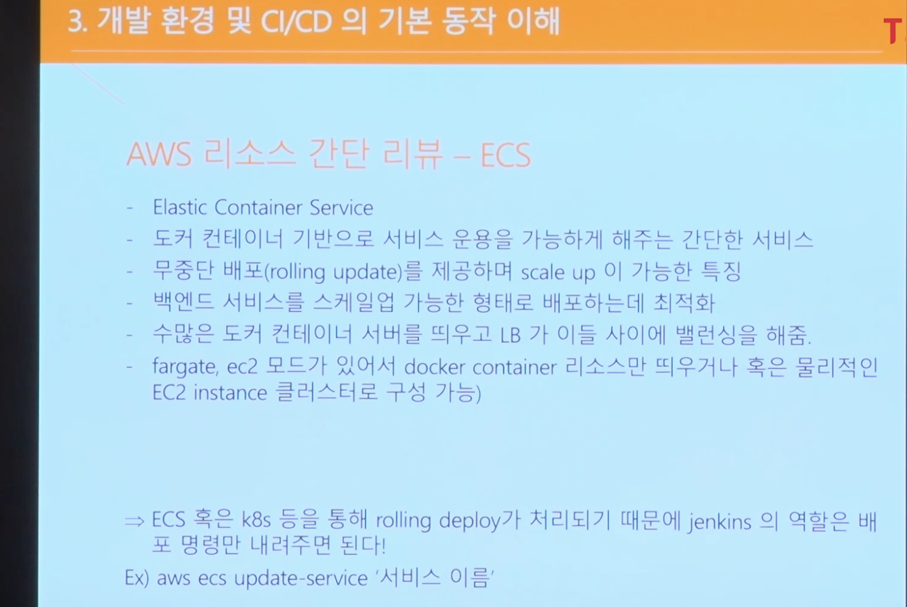

### CI/CD란?

- 각각의 개발자들이 개발을 하는 개발 환경을 사용자가 사용 가능한 서비스로 전달하는 모든 과정을 지속 가능한 형태로 또 가능하다면 자동으로 해서 개발자와 사용자 사이의 격차를 없애는 것이다. 이러한 과정에는 코드를 빌드하고 테스트하고 배포하는 활동이 있다

### Jenkins의 기본 개념

- Java Runtime Environment에서 동작
- 다양한 플러그인들을 활용해서 각종 자동화 작업을 처리할 수 있음
- 일련의 자동화 작업의 순서들의 집합인 파이프라인을 통해 CI/CD 파이프라인을 구축함
- 대표적인 플러그인 : Git Plugin, Pipleline, Crediential Plugin(젠킨스는 그냥 단지 서버일 뿐이기 때문에 배포에 필요한 각종 리소스에 접근하기 위해서는 여러가지 중요한 정보들을 저장하고 있어야한다. 이런 중요한 정보 예를 들면 AWS token, Git access token등을 저장해주는 플로그인) 등
- Pipline이란, CI/CD 파이프라인을 젠킨스에 구현하기 위한 일련의 플러그인들의 집합이자 구성, 즉 여러 플러그인들을 이 파이프라인에서 용도에 맞게 사용하고 정의함을써 파이프라인을 통해 서비스가 배포됨, Pipline Domain Specific Language로 작성.  두가지형태의 Pipline syntax가 존재하는데 최신이자 더 가독성이 좋은 문법인 Declarative Pipline syntax 사용, 레시피를 순서대로 작성하는 것이라고 이해하면 좋음

- Pipline Syntex 의 섹션

  - Agent Section : 젠킨스는 많은 일들을 해야하기 때문에 혼자 하기 버겁다. 여러 slave node를 두고 일을 시킬 수 있는데 이처럼 어떤 젠킨스가 일을 하게 될 것인지 지정한다. 젠킨스 노드 관리에서 새로 노드를 띄우거나 혹은 도커 이미지등을 통해서 처리할 수 있다

  - Post section: 스테이지가 끝난 이후의 결과에 따라서 후속 조치를 취할 수 있다. (Ex, success, failure, always, clean up, 성공시에 성공 이메일, 실패하면 중단 혹은 건너뛰기 등등)

  - Stages section: 어떤 일들을 처리할 건지 일련의 stage를 정의함. 일종의 카테고리라고 보면 됨

    - Declaratives: Environment -> 어떤 pipeline 이나 stage scope 의 환경 변수 설정

       					​						Parameter -> 파이프 라인 실행 시 파라미터 받음

      ​						Triggers -> 어떤 형태로 트리거 되는가, 이 파이프라인이 어떤 주기로 실											행되는 가

      ​						When -> 언제 실행되는가

  - Steps section : Steps 내부는 여러가지 스텝들로 구성, 여러 작업들을 실행 가능, 플러그인을  깔면 사용할 수 있는 스텝들이 생겨남

###  개발 프로세스

1. 개발자가 자신의 PC에서 개발을 진행한다.
2. 다른 개발자가 작성한 코드와 차이가 발생하지 않는지 내부 테스트를 진행한다
3. 진행한 내용을 다른 개발자들과 공유하기 위해서 git과 같은 SCM에 올린다 => 흔히 dev 브랜치
4. Dev 브랜치의 내용을 개발 환경에 배포하기 전에 테스트와 코드 포멧팅을 한다
5. 배포하기 위한 빌드과정을 거친다
6. 코드를 배포한다
7. 테스트를 진행한다.

### AWS 리소스

