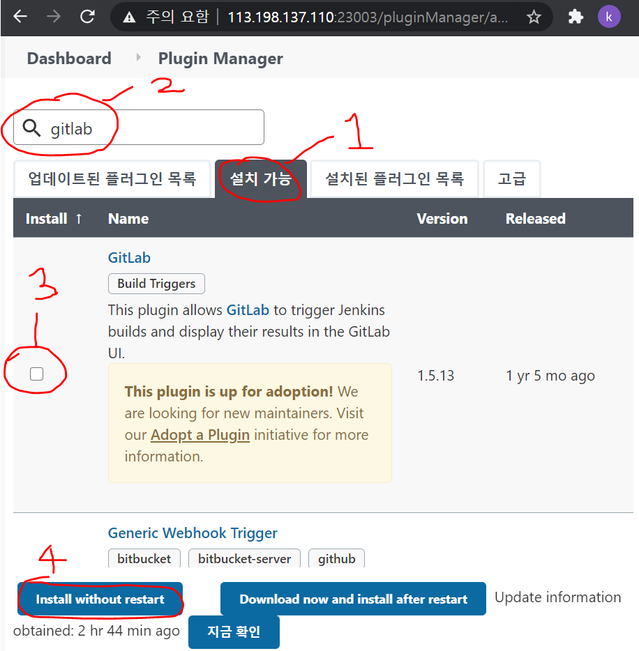
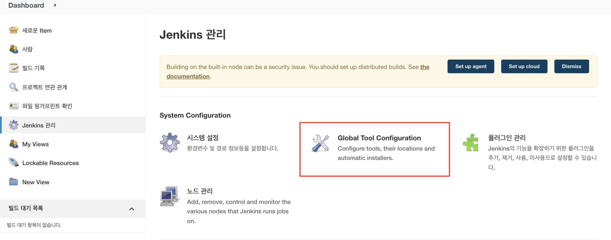
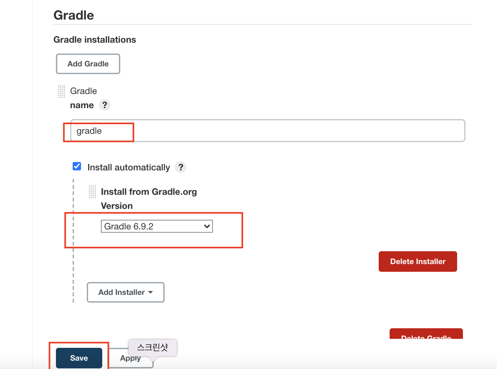
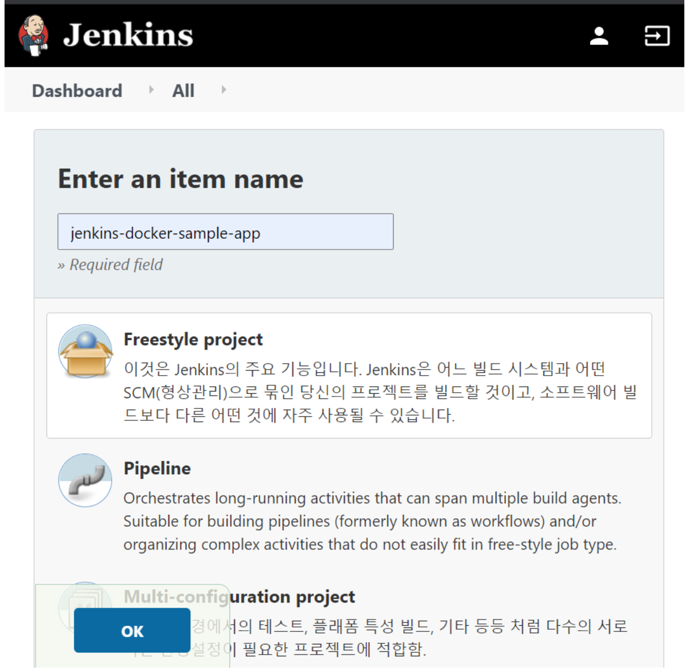
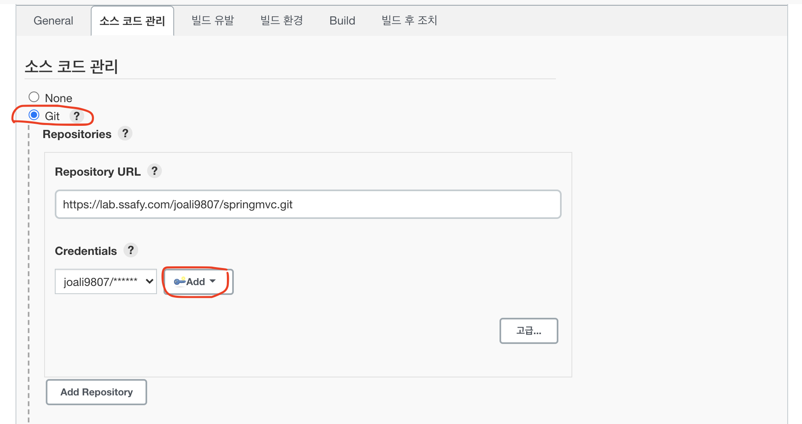
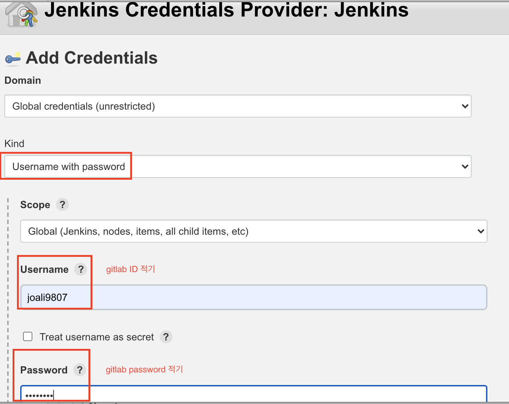
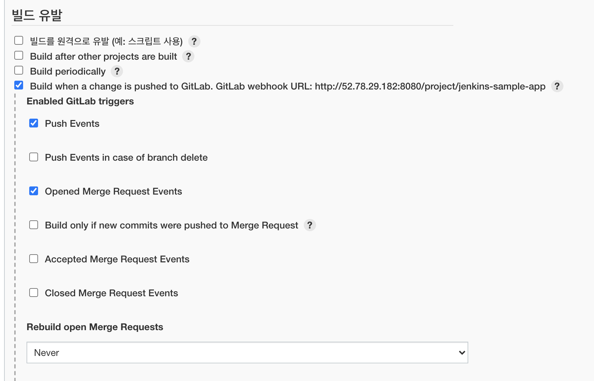
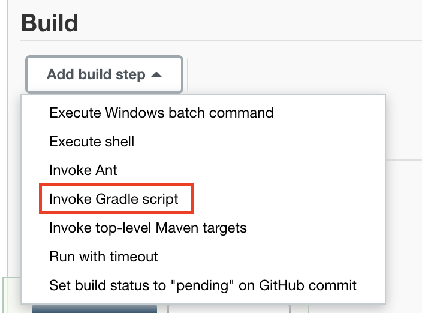
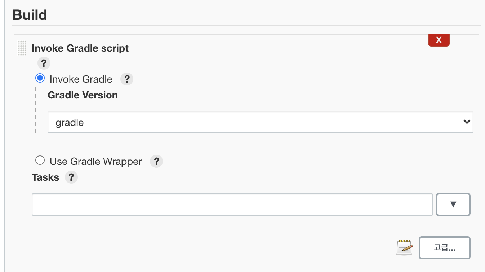
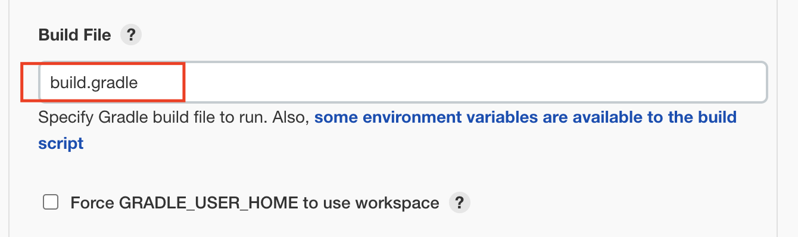

# Jenkins 실습

### 기타 설치

- netstat, ifconfig같은 명령어 쓰기 위해 설치

  ```
  sudo apt-get update && sudo apt-get install net-tools 
  ```

  

- GnuPG 설치 (같은 환경이면 설치 되어있음),Local에서 kms를 설치할 때 필요하다고 함

  ```
  sudo apt-get update && sudo apt-get install --no-install-recommends \
      gnupg
  
  ```


### Docker 설치

- Update the `apt` package index and install packages to allow `apt` to use a repository over HTTPS

  ```
   sudo apt-get update
   
   sudo apt-get install \
      ca-certificates \
      curl \
      gnupg \
      lsb-release
  
  ```

- Add Docker’s official GPG key:

  ```
  curl -fsSL https://download.docker.com/linux/ubuntu/gpg | sudo gpg --dearmor -o /usr/share/keyrings/docker-archive-keyring.gpg
  ```

  

- Use the following command to set up the **stable** repository. To add the **nightly** or **test** repository, add the word `nightly` or `test` (or both) after the word `stable` in the commands below. 

  ```
  echo \
    "deb [arch=$(dpkg --print-architecture) signed-by=/usr/share/keyrings/docker-archive-keyring.gpg] https://download.docker.com/linux/ubuntu \
    $(lsb_release -cs) stable" | sudo tee /etc/apt/sources.list.d/docker.list > /dev/null
  
  ```

  

Install Docker Engine

- Update the `apt` package index, and install the *latest version* of Docker Engine and containerd, or go to the next step to install a specific version:

  ```
  sudo apt-get update
  sudo apt-get install docker-ce docker-ce-cli containerd.io
  ```

- 특정 버전의 docker-compose 설치

  ```
  sudo curl -L "https://github.com/docker/compose/releases/download/1.29.2/docker-compose-$(uname -s)-$(uname -m)" -o /usr/local/bin/docker-compose
  ```

- 권한 설정

  ```
  sudo chmod +x /usr/local/bin/docker-compose
  ```

  

### Jenkins 설치

- jenkins 컨테이너 실행

  ```
  # docker run -v /var/run/docker.sock:/var/run/docker.sock -v /srv/jenkins/home:/var/jenkins_home -p 8080:8080 -p 50000:50000 --name=jenkins jenkins/jenkins
  ```

- /srv/jenkins/home 권한 설정

  ```
  # sudo chown -R 1000:1000 /srv/jenkins/home/
  ```

- 기존의 jenkins 컨테이너 삭제 후 재실행

  ```
  # docker rm jenkins
  
  # docker run -v /var/run/docker.sock:/var/run/docker.sock -v /srv/jenkins/home:/var/jenkins_home -p 8080:8080 --name=jenkins jenkins/jenkins
  ```

  - 젠킨스가 설치되면 password가 나오는데 이걸 복사 또는 저장해두자!

- Jenkins page 접속해서 위 password를 입력

### Jenkins 추가 설정

1. docker binary 설치

-  jenkins 컨테이너에 root 계정으로 접속 (젠킨스는 -u 0 옵션 없이 접속하게 되면 기본적으로 생성되는 'jenkins' 계정으로 접속하게 된다.)

  ```
  # docker exec -it -u 0 jenkins bash
  결과: root@61ad9260759a:/#
  ```

  

- wget 다운로드 후($apt-get update $ apt-get install wget ) docker binary 설치 , tar로 압축 해제

  ```
  # cd ~
  ~# wget https://download.docker.com/linux/static/stable/x86_64/docker-18.06.3-ce.tgz
  ```

  ```
  tar xvfz docker-18.06.3-ce.tgz
  ```

  

- Docker 파일을 /usr/bin/으로 복사 및 컨테이너 종료

  ```
  ~# cp ./docker/docker /usr/bin/
  ~# exit
  ```

- jenkins 계정으로 접속 후 권한 문제 확인

  ```
  # docker exec -it jenkins bash
  /$ docker --version
  /$ docker ps
  /$ exit
  ```

  : -u 0 옵션 없이 로그인하면 위와 같이 jenkins 계정으로 로그인이 된다. 이 상태에서 'docker ps' 등의 명령어를 사용하면 Permission denied가 된다. exit로 컨테이너 접속을 종료한다.

2. Permission 설정

- CentOS 7 서버(호스트)의 docker id 확인

  ```
  # cat /etc/group | grep docker
  결과: docker:x:995: // 그룹 아이디 다를 수 있음
  ```

- 그룹 생성 및 추가

  ```
  # root 계정으로 jenkins 컨테이너에 접속
  [root@localhost ~]# docker exec -it -u 0 jenkins bash
  
  # 호스트의 docker 그룹의 아이디로 docker 그룹을 추가
  root@61ad9260759a:/# groupadd -g 995 docker
  
  # docker 그룹이 잘 추가되었는지 확인
  root@61ad9260759a:/# cat /etc/group | grep docker
  docker:x:995:
  
  # docker 그룹에 jenkins 계정을 추가
  root@61ad9260759a:/# usermod -aG docker jenkins
  
  # 컨테이너 접속 종료
  root@61ad9260759a:/# exit
  exit
  ```

  

- jenkins 컨테이너 재실행

  ```
  # docker restart jenkins
  ```

- Jenkins 계정으로 로그인 뒤 docker 명령어 실행 가능 여부 확인

  ```
  # docker exec -it jenkins bash
  /$ docker ps
  /$ exit
  ```

  : Permission denied가 생기지 않음


​	++ 젠킨스 컨테이너를 재실행하고 확인하기 위해서는 

```
# docker start jenkins
# docker ps
```


### Jenkins에서 gitlab 연동

- **Jenkins에 gitlab 플러그인 설치**

  

  

  ------

  

- **Gradle 설정**

  

  

  

  ------

  

- Jenkins item 등록: Jenkins 대시보드 홈에서 '새로운Item 클릭' 후 item name을 적당히 입력하고, Freestyle project를 선택한 뒤, 하단의 OK 버튼을 눌러서 진행한다.



- Git으로 변경 후 gitlab url 입력. 이때 꼭 clone의 https로 작성할 것. 




- Add를 누르면 나오는 화면인데 username에는 gitlab ID를 적고 password에는 gitlab password를 적는다. 그 아래에 나오는 필드에도 아이디를 적으면 될듯,,? 이건 정확하지 않아서 찾아보기



- 아래로 스크롤 또는 '빌드 유발' 탭을 선택한 뒤, 위 그림처럼 'Build when a change is pushed...'를 체크한다.




- Build 파트에서 'Invoke Gradle script'를 클릭한 후 설정해준 Gradle로 선택한다.





- Build File 파트에서 내 폴더 구조에서 build.gradle이 어딨는 파악 후 넣어준다. 지금 예시의 경우 다른 폴더 안에 있는 것이 아니라 바로 build.gradle이 있으므로 'build.gradle'이라고 입력해주었다. 파일이름/build.gradle로 써야할 수도 있다.




참고 : https://not-to-be-reset.tistory.com/333?category=916741

