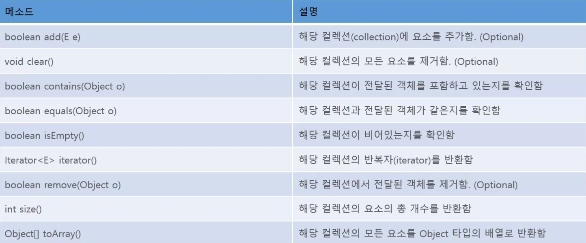

# Java Collection Framework
일반적으로 생각하는 자료구조라고 생각하면 됨. 암기 필수.

## 주요 인터페이스
- List : 순서가 **있는** 데이터의 집합, 중복을 허용 (Vector, ArrayList, LinkedList, Stack, Queue)
- Set : 순서가 **없는** 데이터의 집합, 중복을 허용X (HashSet, TreeSet)
- Map : Key와 Value의 한쌍으로 이루어진 데이터의 집합, Key의 중복X (HashMap, SortedMap, HashTable)

## Collection Interface의 메소드들

## List Collection
- ArrayList : 빠른 검색, 순차적인 데이터 추가에 유리, 빈번한 추가 삭제에 불리, Thread safe 하지 않음
- Vector : ArrayList와 유사한 내부구조 + Thread safe
- LinkedList : 잦은 삭제, 추가에 유리

## Set Collection
- HashSet : 입력순서대로 저장순서 보장X, 중복X, 데이터 정렬X  
            hash에 의해 데이터의 위치를 특정시켜 해당 데이터를 빠르게 서치할수있게 만든 것  
	        삽입, 삭제, 색인이 매우 빠른 컬렉션  
- TreeSet : 입력순서대로 저장순서 보장X, 중복X  
	        데이터의 가중치에 따른 순서대로 정렬, 중복되지 않으면서 특정 규칙에 의해 정렬된 형태의 집합  
	        특정 구간의 집합요소들을 탐색할때 유용  
- LinkedHashSet : 입력순서대로 저장순서 보장O, 중복X  
	        중복은 허용하지 않으면서 순서를 보장받고싶은 경우 사용  

## Map Collection
- HashTable : JDK 1.0부터 사용해 온 HashMap 클래스와 같은 동작을 하는 클래스  
        	JDK 1.4부터는 HashTable 보다는 HashMap 클래스를 사용하는 것을 권장  
- HashMap : Map 컬렉션 클래스에서 가장 많이 사용되는 클래스 중 하나  
            해시 알고리즘을 사용하여 검색속도가 매우 빠름
- TreeMap : 키와 값을 한 쌍으로 하는 데이터를 이진 검색 트리(binary search tree)의 형태로 저장
