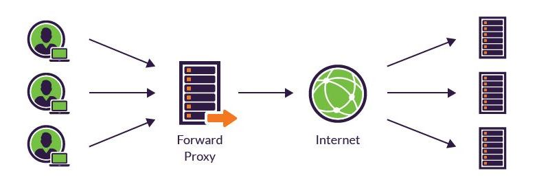

# Proxy(Forward & Reverse)

## Proxy
프록시 서버는 클라이언트가 자신을 통해서 다른 네트워크 서비스에 간접적으로 접속할 수 있게 해 주는 컴퓨터 시스템이나 응용 프로그램을 가리킨다.
서버와 클라이언트 사이에 중계기로써 대리로 통신을 수행하는 것을 가리켜 '프록시', 그 중계 기능을 하는 것을 프록시 서버라고 부른다.
프록시 서버는 서버로 요청된 내용을 캐시 해 놓고 동일한 요청 시 바로 응답을 주도록 설정할 수도 있어 시간과 리소스 사용을 절약할 수 있다.
HTTPS의 인증서 관리를 하나의 프록시 서버가 담당하고 뒤에 동작하고 있는 서버는 HTTP로 서비스할 수 있다. 이렇게 되면 서버를 실행할 때마다 인증서를 관리하지 않아도 된다.

## Forward Proxy

클라이언트가 서버로 요청할 때 직접 요청하지 않고 프록시 서버를 통해 요청하는 방식이다.
네트워크 엣지에 위치하지만 공유 네트워크의 사전 설정된 정책에 따라 아웃바운드 트래픽을 규제한다.
보통 대학 및 기업과 같은 대규모 조직의 내부 인트라넷에서 인터네상에 있는 서버에 요청할 때 먼저 프록시 서버를 호출한다.
서버에게 클라이언트가 누구인지 감추는 역할을 한다.
ex)
직원이 특정 웹사이트를 방문하지 못하도록 차단
직원의 온라인 활동 모니터링
악성 트래픽이 원본 서버에 도달하지 못하도록 차단
외부 사이트 컨텐츠를 캐싱하여 사용자 경험 향상
서버가 응답받은 IP는 포워드 프록시 서버의 IP이기 때문에 클라이언트가 누군지 알 수 없음

## Reverse Proxy

클라이언트가 서버를 호출할 때 리버스 프록시를 호출하게 되고 프록시 서버가 오리지널 서버에 요청하여 받은 응답을 클라이언트에게 전달하는 방식이다. 
다시 말하자면 내부 인트라넷에 있는 서버를 호출하기 위해서 인터넷 망에 있는 클라이언트가 리버스 프록시 서버에 요청하여 응답을 받는다.
서버가 누구인지 클라이언트로부터 감추면서 게이트웨이 역할을 한다.
그렇게 함으로써 모든 정책 관리 및 트래픽 라우팅을 처리한다.
클라이언트는 리버스 프록시 서버를 먼저 호출하게 되기 때문에 실제 서버의 IP를 알 수 없다.
##### 리버스 프록시의 동작 방식
- 유저의 연결 요청을 받는다.
- TCP 3 handshake를 완료하고, 첫 연결을 종료한다.
- 오리지널 서버와 연결 및 요청에 대한 응답을 전달한다.

## 프록시의 장점
##### (1) 보안
실제 서버 또는 클라이언트의 IP를 숨기고 프록시 서버의 IP만 공개함으로써 해킹을 대비할 수 있다.
##### (2) 성능 향상
캐싱 기능과 트래픽 분산으로 성능 향상을 기대 할 수 있다.
일부 프록시 서버는 로드 밸런싱도 제공하여 여러 대의 분산된 서버가 있다면 서버의 트랙픽을 분산시켜 준다.
또한 앤드 포인트마다 호출하는 서버를 설정할 수 있어 역할에 따라 서버의 트래픽을 분산할 수도 있다.

**출처**
[프록시 서버](https://ko.wikipedia.org/wiki/%ED%94%84%EB%A1%9D%EC%8B%9C_%EC%84%9C%EB%B2%84)
[Reverse Proxy](https://www.imperva.com/learn/performance/reverse-proxy)
[Forward Proxy와 Reverse Proxy 차이점](https://firework-ham.tistory.com/23)
