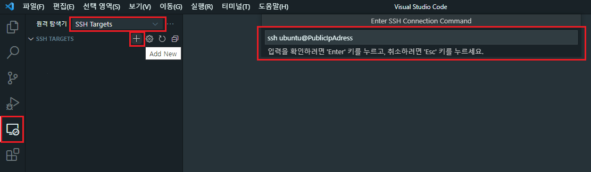

## AWS EC2 원격 접속(VSCode)


### 1. vscode 마켓플레이스에서 remote development 설치  

#### *아래 이미지에서 레드박스 유의하며 진행

### 2. vscode 왼쪽 메뉴바에서 원격탐색기 클릭

### 3. 좌상단 원격탐색기 선택박스에서 SSH Targets 선택

### 4. +버튼(Add New) 누르기

### 5. Connection Command창에 ` ssh user@퍼블릭아이피주소 ` 입력 (퍼블릭아이피주소 대신 도메인도(i6c202.p.ssafy.io) 가능)

### 6. C:\Users\User\.ssh\config 클릭
+ .ssh폴더가 없거나 config파일이 없다면 생성하기

### 7. config 파일에 다음과 같이 입력 후 저장
   ```
   Host i6c202.p.ssafy.io
     HostName i6c202.p.ssafy.io
     User ubuntu
     ForwardAgent yes
     IdentityFile .ssh/I6C202T.pem
   ```

### 8. .ssh 폴더 안에 pem 키 생성(다운)하기

### 9. SSH TARGETS에 생긴 EC2주소 클릭후 우측 아이콘(Connect to Host in New Window) 클릭

### 10. 새창이 열리면 Linux 클릭 후 Continue 클릭

### 11. 터미널창을 열어 EC2 인스턴스 원격 제어
