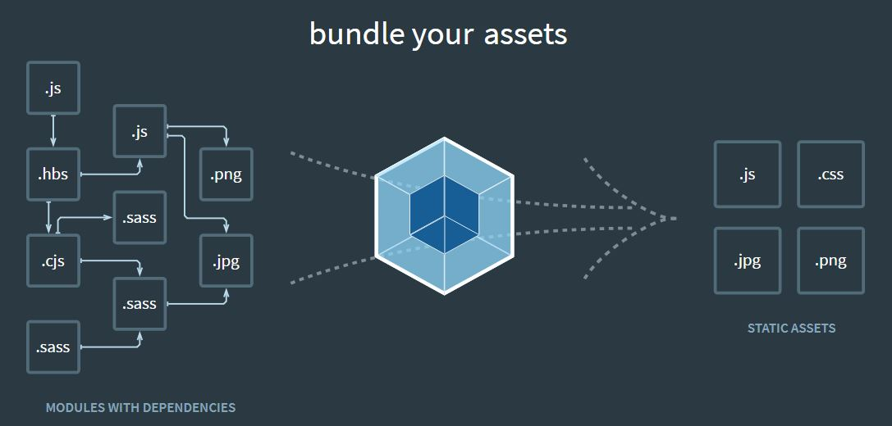

# Babel & Webpack

## Babel
JavaScript Compiler (Transpiler - 소스 대 소스 컴파일러)  
기존의 컴파일러처럼, 소스코드를 바이너리 파일로 변환하는 것은 아니지만,  
**(1) React의 JSX문법을 Vanilla JavaScript로 변경하거나,**  
**(2) 최신버전의 문법을 구 버전 문법으로 변환해 준다.**  

### 1. JSX 를 Vanilla JavaScript로 변경해 준다. 
React에서는 JSX라는 React 만의 특별한 문법을 사용한다.  
하지만, JSX 문법은, 브라우저가 해석할수 없기 때문에,  
브라우저가 이해할 수 있는 Vanilla JS로 변경해 주어야 한다.  

### 2. 최신버전의 문법을 구 버전 문법으로 변환 해 준다.
ECMA에서 매년 표준을 정하고 있기는 하지만,  
모든 브라우저가 최신의 ECMAScript 문법을 다 따르고 있는 것은 아니다.  
따라서, 우리는 가능한 한 많은 브라우저를 지원하기 위해  낮은 버전의 ECMAScript 문법을 지원 할 필요가 있다.  
babel은 최신문법의 JS를 낮은 버전의 JS로 변환해주는 역할도 한다.  

> JavaScript는 ECMAScript 사양을 준수하는 범용 스크립팅 언어이다.

## Webpack
  
webpack은 JavaScript의 static module bundler, 즉 JavaScript Application의 모든 코드들을 잘 모아서 합쳐준다.  
그리고, 브라우저가 쉽게 이해 할수 있는 형태로 바꾸어 준다.  
webpack은 일종의 build system 이라고도 할수 있다.  
webpack은 JavaScript Application에 있는 여러 타입의 파일을 설정에 따라서 transpile 한다.
그 대상에는 물론 JSX, JavaScript도 있다.  
이 JSX, JavaScript를 transpile하기 위해 webpack은 babel을 사용한다.  
또한, webpack은 sass로 작성된 파일도, css로 transpile 한다. 이때는 babel 대신 sass-loader를 사용한다.  
- [URL related to webpack loader](https://webpack.js.org/loaders)  

**출처**  
[[React] babel과 webpack의 차이](https://hianna.tistory.com/665?category=982328)
