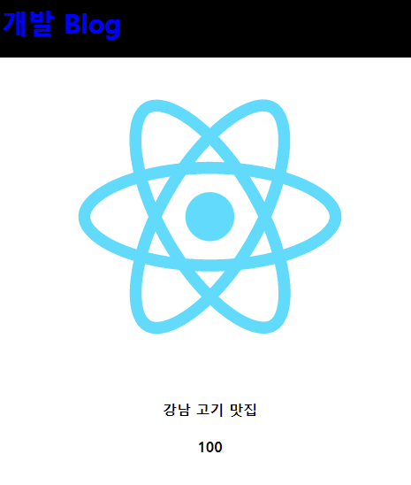

## 1강

리액트 앱 만들기
npx create-react-app name


app.js : 메인페이지의 html을 짜는 곳

npm start : 라이브화면 띄우기


nodejs 설치 이유 : npm이라는 툴 설치 가능

public: static 파일 보관함


app.js 에서

```javascript
import logo from './logo.svg';
import './App.css';

function App() {

  const posts = '강남 고기 맛집'; 
  function 함수() {
    return 100
  }

  return (
    <div className="App">
      <div className="black-nav">
        <div style={ { color : 'blue', fontSize : '30px'} }>개발 Blog</div>
      </div>
      
      <h4> { posts } </h4>
      <h4> { 함수() } </h4>
    </div>
  );
}
```

여기에 HTML을 쓰는 것 처럼 코드 작성
단!!!! 이는 HTML이 아니고 JSX이다!

기존의 html에서 class="" 대신
className을 쓴다!


리액트를 쓰는 가장 큰 이유 : 쉬운 데이터 바인딩


## 2강 : node.js는 왜 쓰는건가?

리액트 앱 만들기
npx create-react-app name


app.js : 메인페이지의 html을 짜는 곳

npm start : 라이브화면 띄우기


nodejs 설치 이유 : npm이라는 툴 설치 가능

public: static 파일 보관함


## 3강 : 리액트는 데이터 바인딩 때문에 쓰는건데요?

app.js 에서

```javascript
import logo from './logo.svg';
import './App.css';

function App() {

  const posts = '강남 고기 맛집'; 
  function 함수() {
    return 100
  }

  return (
    <div className="App">
      <div className="black-nav">
        <div style={ { color : 'blue', fontSize : '30px'} }>개발 Blog</div>
      </div>
      
      <h4> { posts } </h4>
      <h4> { 함수() } </h4>
    </div>
  );
}
```

여기에 HTML을 쓰는 것 처럼 코드 작성
단!!!! 이는 HTML이 아니고 JSX이다!

기존의 html에서 class="" 대신
className을 쓴다!


리액트를 쓰는 가장 큰 이유 : 쉬운 데이터 바인딩
중괄호를 이용해서 쉽게 데이터를 바인딩 가능! (posts, 함수, img src)
스타일은 기존의 html과 다르게 jsx에서는 중괄호를 주어 오브젝트 형식으로 가져와야 하는데
이게 귀찮으니 이 또한 className으로 가져오는게 대부분임




## 4강 state : 새로고침 없이 재렌더링

자주 바뀌는, 중요한 데이터는 state에 저장하자!

destructuring : JS 신문법, 어레이처럼 여러개 저장해놓고 인덱스로 가져올 수도 있음

useState는 사용자가 어떤 값을 변경해도 새로고침 없이 바로 재렌더링!!!
useState 쓰려면 상단에서 import 해야함!!!

```javascript
import React, { useState } from 'react';

var [a,b] = [10,100];
let [글제목, 글제목변경] = useState('남자 코트 추천');
const [숙제제목, 숙제제목변경] = useState(['숙제1', '숙제2', '숙제3']);
```


실습 코드 & 출력 결과

```javascript
import React, { useState } from 'react';
import logo from './logo.svg';
import './App.css';

function App() {

  const posts = '강남 고기 맛집'; 
  const [글제목, 글제목변경] = useState(['남자 코트 추천', '강남 우동 맛집']);
  const [숙제제목, 숙제제목변경] = useState(['숙제1', '숙제2', '숙제3']);

  return (
    <div className="App">
      <div className="black-nav">
        <div>개발 Blog</div>
      </div>
      <div className="list">
        <h3>{ 글제목[0] }</h3>
        <p>2월 17일 발행</p>
        <hr/>
        <h3>{ 숙제제목[0] }</h3>
        <p>2월 17일 발행</p>
        <hr/>
        <h3>{ 숙제제목[1] }</h3>
        <p>2월 17일 발행</p>
        <hr/>
        <h3>{ 숙제제목[2] }</h3>
        <p>2월 17일 발행</p>
        <hr/>
      </div>
    </div>
  );
}

export default App;
```

