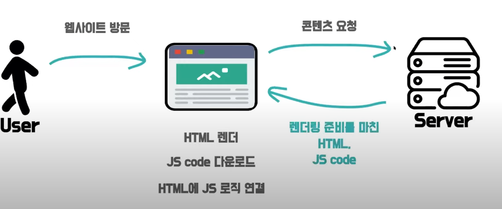

## CSR & SSR

#### SPA & MPA

* SPA : Single Page Application
  헤더는 고정되어 있고 사용자가 클릭함에 따라
  메인화면 혹은 클릭한 부분만 바뀜
* MPA : Multi Page Application
  탭을 이동할 때 마다 서버로부터 새로운 HTML을
  새로 받아와서 페이지 전체를 새로 렌더링 하는
  전통적인 web page 구성 방식

#### CSR, SSR - SPA, MPA 관계

* 일반적으로
  CSR === SPA 	SSR === MPA
  이렇게 알고 있지만
  정확하게는 페이지가 몇개냐 vs 렌더링을
  어디서 하냐 차이임!
  따라서
  CSR != SPA	SSR != MPA
  이다

#### CSR & SSR

* CSR : Client Side Rendering
* SSR : Server Side Rendering : 요청시 서버에서 즉시 HTML을 만들어 작동하는 방식
                                                      미리 모두 만들어두기 어려운, 혹은 불필요한 페이지에 적합
* SSG : Static Site Generation : 페이지들을 서버에 미리 모두 만들어 둔 뒤 요청시 응답하는 방식
  (Static Rendering)                    바뀔 일이 거의 없는 페이지에 적합

## CSR

* 초기 로딩 속도 느림
  하지만 이후 구동 속도 빠름
* 서버가 빈 뼈대의 HTML만 넘겨주기 때문에
  서버 부하가 적고, 클라이언트 측에서 연산, 라우팅 등을
  모두 처리하기 때문에 반응속도가 빨라 UX가 우수함
* HTML이 비어있기 때문에 SEO(Search Engine Optimization : 검색 엔진 최적화)에 불리
  (Javascript로 모든게 구성되어 있기 때문)

## SSR

* 초기 구동 속도 빠름(로딩이 된것부터 사용자 화면에 노출)
  하지만 이것이 단점이 될 수 있음(ex : 버튼은 있으나 아직 기능을 못하는 경우)
  TTV !== TTI   (time to view !== time to interact)

#### CSR, SSR 장단점

|          | CSR                                                          | SSR                                                          |
| -------- | ------------------------------------------------------------ | ------------------------------------------------------------ |
| **장점** | - 화면 깜빡임이 없음 -초기 로딩 이후 구동속도가 빠름 -TTV와 TTI 사이 간극이 없음 -서버 부하 분산 | -초기 구동속도가 빠름 -SEO에 유리함                     |
| **단점** | -초기 로딩 속도가 느림 -SEO에 불리함                    | -화면 깜빡임이 있음 -TTV와 TTI 사이 간극이 있음 -서버 부하가 있음 |

