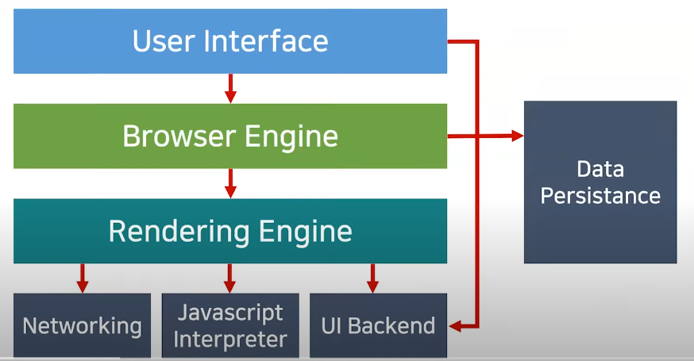

## 브라우저 작동 원리

#### User Interface

* 주소 표시줄, 이전/다음/새로고침 버튼 등
  **웹 페이지를 제외**하고 사용자와 상호작용 하는 **사용자 인터페이스**

#### Rendering Engine

* HTML과 CSS를 파싱하여 요청한 웹 페이지를 **표시** 하는 **렌더링 엔진**

#### Browser Engine

* 유저 인터페이스와 렌더링 엔진을 **연결**하는 **브라우저 엔진**

#### Networking, Javascript Interpreter, UI **Backend**

* ***Networking*** : 각종 네트워크 요청을 수행하는 네트워킹 파트
* ***UI Backend*** : 체크박스나 버튼과 같은 기본적인 위젯을 그려주는 UI 백엔드 파트
* ***Javascript Interpreter*** : 자바스크립트 코드를 실행하는 인터프리터

#### Data Persistence

* localStorage나 Cookie와 같이 **보조 기억장치**에 **데이터를 저장하는 파트**

  

