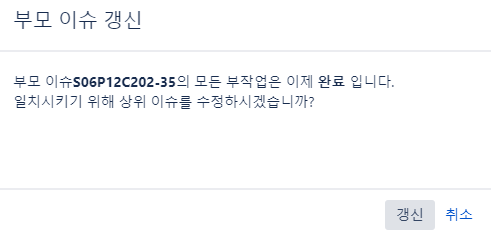

## Jira Convention

#### story vs task

* story : 개발과 관련된 요구사항 및 기능 개발과 관련된 것 (코딩하는 것만!)
* 개발과 관련 없는 문서작업이나 다른 기타 작업 (study, ucc제작, 발표준비, 기획 미팅 등)

#### sub task

* 규칙 : 날짜 적고 각자 상세 업무 적기
  * ex) 0117 오전 react study
  * ex) 0117 오후 Main component

### ★주의★

* 아래와 같은 창이 뜨면 반드시 '취소' 누르고 
  김승환 or 김근태 에게 말하기!!

스토리 or 작업에 마지막 남은 부작업 태스크를 '완료'로 옮길 경우 위와 같은 창이 뜨는데
저기서 ''갱신''을 누르면 스토리 or 작업이 '완료' 된 상태로 변함

변하면 되돌릴 수 없는것 같아서 혹시 모르니 우선 '취소' 누르고 
확인한 다음 갱신을 하기 위함!