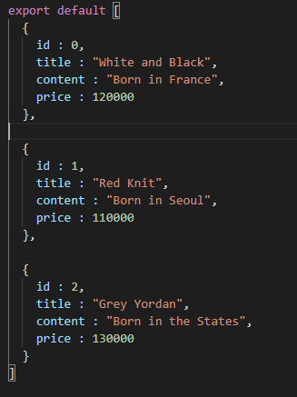

## 6강 : Link, useHistory, push, Switch

* 보통 컴포넌트 파일은 대문자로 시작

* 컴포넌트 파일에도 아래 코드는 필수!

  ```javascript
  최상단에
  import React, {useState} from 'react';
  
  가장 하단에
  export default 변수명;
  ```

* 불러올 때 App.js 에서

  ```javascript
  최상단에
  import 사용할변수명 from './파일이름'
  
  <Route path="/뒤에 붙을 url">
    <사용할변수명/>
  </Route>
  ```

#### Link

```javascript
import { Link, Route, Switch } from 'react-router-dom';

<Link to='/'>Home<Link>
```

* to = '/경로'

#### History

* history : 방문기록 등을 저장해놓는 object
* useHistory : 훅

```javascript
import { Link, Route, Switch } from 'react-router-dom';

이후 function안에 선언

function ~~~() {
  const history = useHistory();
  return(
  <button className="btn btn-danger" onClick={()=>{ 
    history.goBack();
  }}>뒤로가기</button> )
}

```

history.goBack(); 을 버튼에 붙여주기

* history.goBack(); 대신 history.push('/') 를 붙이면 해당 경로로 이동!

#### Switch

```javascript
import { Link, Route, Switch } from 'react-router-dom';

	<Route path="/:id">
      </Route>
	<Switch></Switch>
```

"/:id" = /모든문자 라는 경로를 의미 (아무거나 적든 상관없음)

* Switch 컴포넌트
  * React 컴포넌트는 특징상 매칭되는걸 모두 보여줌 (exact쓰면 아니지만!)
  * Switch는 여러개가 맞아도 하나만 보여줌!


## 7강 `<Route path="/:id"> ` 상세페이지 100개 만들기

* App.js

  ```javascript
  </Route>
    <Route path="/detail/:id">
    <Detail shoes={shoes}/>
  </Route>
  ```

* Detail.js

  ```javascript
  import React, {useState} from 'react'
  import { useHistory, useParams } from 'react-router-dom';
  
  function Detail(props){
    const { id } = useParams();
    const history = useHistory();
    const item = props.shoes.find(function(shoes){
      return shoes.id == id
    })
    return(
      <div className="container">
          <div className="row">
            <div className="col-md-6">
              
            </div>
            <div className="col-md-6 mt-4">
              <h4 className="pt-5">{item.title}</h4>
              <p>{item.content}</p>
              <p>{item.price}</p>
              <button className="btn btn-danger">주문하기</button> 
              <button className="btn btn-danger" onClick={()=>{ 
                history.goBack();
               }}>뒤로가기</button> 
            </div>
          </div>
        </div>
    )
  }
  
  export default Detail;
  ```

  여기서 아래 코드는 홈에서 상품들을 특정 기준을 가지고 정렬했을 시 
  주소에 따라 보이는 상품이 달라지면 안되기 때문에 ***데이터 파일***에 있는 id 값을 이용하여
  정렬하여 보이는 상품이 달라져도 같은 주소에 같은 상품이 보이도록 하기 위함

  ```javascript
    const item = props.shoes.find(function(shoes){
      return shoes.id == id
    })
  ```

  


## 8강 : react styling1 - styled-components

* component가 많아지면 CSS작성 고민이 많아짐
  실수로 class를 중복으로 만드는 경우도 있음
  이런 실수들을 방지하고자 class 선언 없이
  컴포넌트에 CSS를 직접 장착
  (CSS in JS라고도 함)
* styled-components는 필수사항이 아니고 선택사항!
  컴포넌트가 3~4개다? 굳이 써야해?
  컴포넌트가 3~40개다? class명 다 외울수 있어? styled-components쓰자!

1. ```javascript
   npm install styled-components
   ```

2. ```javascript
   import styled from 'styled-components';
   ```

3. ```javascript
   const 박스 = styled.div`
     padding : 20px;
   `;
   ```

   '박스'라는 컴포넌트를 만들고 ``***(백틱)*** 안에 스타일링하는 방법!

4. ```javascript
   <div></div> 대신에
   <박스></박스> 안에 입력하면 padding이 20px 스타일이 적용됨
   ```

* tip! 제목 색갈만 다른 여러개 스타일은 만들기 귀찮아.
  같은 styled-components 쓰면서 색갈만 다르게 줄 순 없나?

  * ```javascript
    const 제목 = styled.h4`
      font-size : 25px;
      color : ${ props => props.색상 }
    `;
    
    function Detail(props) {
      return (
        <제목 색상={'red'}>Detail<제목>
        <제목 색상={'blue'}>Detail<제목>
    )}
    ```

    