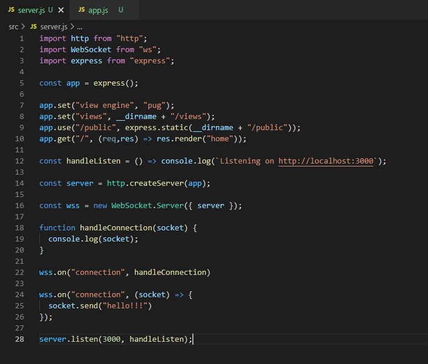
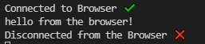
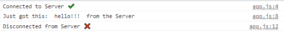
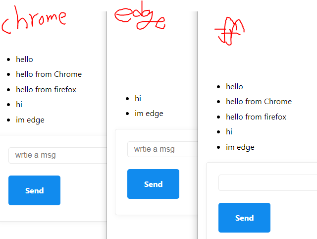

## NodeJS 개발환경 구축


### 1. nodemon.json

##### Nodemon을 설정하기 위해 nodemon.json 파일 생성

Nodemon : 프로젝트에 변경 사항이 있을 시 서버를 재시작해주는 프로그램

```json
{
  "ignore": ["src/public/*"],
  "exec": "babel-node src/server.js"
}
```

* Babel-node
  * 서버를 재시작하는 대신 우리가 작성한 코드를 일반 NodeJS코드로 컴파일
  * 위 작업을 src/server.js 파일에 해줌

### 2. server.js 서버만들기!

* server.js

```js
import express from "express";

const app = express();

app.set("view engine", "pug");
app.set("views", __dirname + "/views");
app.use("/public", express.static(__dirname + "/public"));
app.get("/ ", (req,res) => res.render("home"));

const handleListen = () => console.log(`Listening on http://localhost:3000`);
app.listen(3000, handleListen);
```

* express를 import하고, 
  express 어플리케이션을 구성하고,
  view engine을 pug로 설정하고, 
  views 디렉토리를 설정하고,


### ws: a Node.js WebSocket library

npm i ws



```js
function handleConnection(socket) {
  console.log(socket);
}

wss.on("connection", handleConnection)

```

connection : 연결됐을 때!


## 채팅기능 구현하기 (Without SocketIO)

* server.js

  ```js
  wss.on("connection", (socket) => {
    console.log("Connected to Browser ✔️");
    socket.on("close", () => console.log("Disconnected from the Browser ❌"));
    socket.on("message", (message) => {
      console.log(message.toString("utf8"));
    });
    socket.send("hello!!!");
  });
  ```

  

  

  

* app.js

  ```js
  const socket = new WebSocket(`ws://${window.location.host}`);
  
  socket.addEventListener("open", () => {
    console.log("Connected to Server ✔️");
  });
  
  socket.addEventListener("message", (message) => {
    console.log("Just got this: ", message.data, " from the Server");
  });
  
  socket.addEventListener("close", () => {
    console.log("Disconnected from Server ❌");
  });
  
  setTimeout(() => {
    socket.send("hello from the browser!");
  }, 10000);
  
  ```

  


------------------------------- 여기 까지는 혼자 대화하기 -----------------------------------------

## 여러 브라우저(사람들과) 대화하기

#### server.js

```js
const sockets = [];

wss.on("connection", (socket) => {
    sockets.push(socket);
 	socket.on("message", (message) => {
      sockets.forEach((aSocket) => aSocket.send(message.toString("utf8")));
    });
})
```

#### app.js

```js
socket.addEventListener("message", (message) => {
  const li = document.createElement("li");
  li.innerText = message.data;
  messageList.append(li);
});
```




## 닉네임 설정

* nickname을 설정하는 input을 만들어 주고
  사용자가 자신이 쓸 닉네님을 적으면 그 닉네임을
  메세지로 socket에 send해야함
  그러나 서버는 어느 메세지가 닉네임인지 구분을 못함
  따라서 채팅 메세지와 닉네임 메세지를 구분하기 위해
  type을 사용!

#### app.js

```js
function makeMessage(type, payload) {
  const msg = { type, payload };
  return JSON.stringify(msg);
}

function handleSubmit(event) {
  event.preventDefault();
  const input = messageForm.querySelector("input");
  socket.send(makeMessage("new_message", input.value));
  input.value = "";
}

function handleNickSubmit(event) {
  event.preventDefault();
  const input = nickForm.querySelector("input");
  socket.send(makeMessage("nickname", input.value));
  input.value = "";
}

messageForm.addEventListener("submit", handleSubmit);
nickForm.addEventListener("submit", handleNickSubmit);
```

각 input에 submit 버튼을 누르면 해당하는 함수 호출하도록 작성

각각 type을 "new_message"와 "nickname"으로 구분하여 
makeMessage 함수에서 JSON.stringify(msg);를 통해
java object를 string으로 바꿔서 리턴함
(이는 백엔드는 java뿐 아니라 다른 언어로도 실행될 수 있어서!!)


#### server.js

```js
const sockets = [];

wss.on("connection", (socket) => {
  sockets.push(socket);
  socket["nickname"] = "Anonymous";
  
  socket.on("message", (msg) => {
    const message = JSON.parse(msg);
	switch (message.type) {
    case "new_message":
      sockets.forEach((aSocket) =>
        aSocket.send(`${socket.nickname}: ${message.payload}`)
      );
      break;
    case "nickname":
      socket["nickname"] = message.payload;
      break;
    }
  });
});
```

각 타입을 구분하여 맞는 동작을 실행!

아직 nickname을 정하지 않은 사용자는 익명으로 칠 수 있도록
connection이 됐을 때

```js
socket["nickname"] = "Anonymous";
```

코드를 통해 익명으로 채팅을 칠 수 있게 함!


각 case문 밑에 break!!!
switch 는 break를 만날 때까지 코드가 실행된다.

