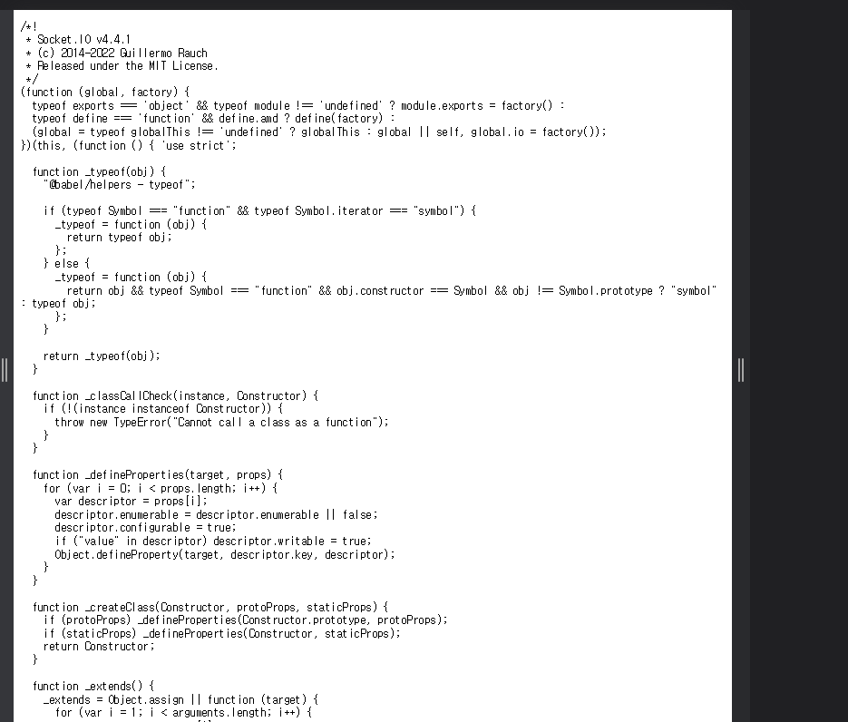
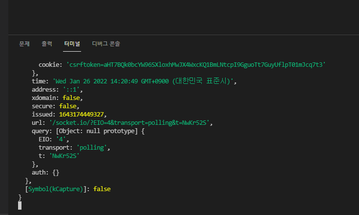

# SOCKETIO #1


https://socket.io/


socketio는 웹소켓을 지원하지 않는경우 다른것들을 사용한다.

websocket을 사용하지만 웹소켓의 부가기능이아니다.

https://socket.io/get-started/chat


프론트와 백엔드간 실시간 통신을 가능케하는 프레임워크다.


---

```
npm i socket.io
```

```js
server.js

import express from "express";
import http from "http"
// import WebSocket from "ws";
import SocketIO from "socket.io"
........

const httpServer = http.createServer(app)
const wsServer = SocketIO(httpServer)

.....

const handleListen = () => console.log(`Listening on http://localhost:3000`)
httpServer.listen(3000, handleListen)
```

http랑 ws서버 구분하기위해 이름 재정의


http://localhost:3000/socket.io/socket.io.js 로이동



이런페이지가 나온다.


websocket은 브라우저에 있어서 설치할 필요가 없었지만 socket IO는 브라우저에 설치를 해줘야한다.


http://localhost:3000/socket.io/socket.io.js 그게 이 파일임


---

app.js와

home.pug에있는 기존의 websocket코드는 다 지워주고 새로 짜야한다.



이와같이 쭉 올려보면 터미널(서버메세지)에 쭉나오는데 기존의 웹소켓에선 직접해야했던 socket = []

이라던가 여러 기능을 다알아서 해준다.

```js
app.js

const socket = io()
// 이것만해주면 알아서 다 찾아줌


```

```html
home.pug

doctype html
html(lang="en")
  head
    meta(charset="UTF-8")
    meta(http-equiv="X-UA-Compatible", content="IE=edge")
    meta(name="viewport", content="width=device-width, initial-scale=1.0")
    title Noom
    link(rel="stylesheet", href="https://unpkg.com/mvp.css")
  body 
    header 
        h1 Noom!
    main

        
    //- 브라우저안에 소켓.io설치해줘야함
    script(src="/socket.io/socket.io.js")
    script(src="/public/js/app.js")
```

```js
server.js

import express from "express";
import http from "http"
// import WebSocket from "ws";
import SocketIO, { Socket } from "socket.io"


const app = express();

app.set("view engine","pug")
app.set("views",__dirname + "/views")
app.use("/public",express.static(__dirname+"/public"))
app.get("/",(req,res)=> res.render("home"))
app.get("/*",(req,res) => res.redirect("/"))


const httpServer = http.createServer(app)
const wsServer = SocketIO(httpServer)

wsServer.on("connection",socket =>{
  console.log(socket)
})


// const wss = new WebSocket.Server({ server })

// function onSocketClose(){
//   console.log("Disconnected from the Browser X")
// }


// const sockets = []
// wss.on("connection", (socket) => {
//   sockets.push(socket);
//   socket["nickname"] = "Anon";
//   console.log("Connected to Browser ✅");
//   socket.on("close", onSocketClose);
//   socket.on("message", (msg) => {
//     const message = JSON.parse(msg);
//     switch (message.type) {
//       case "new_message":
//         sockets.forEach((aSocket) =>
//           aSocket.send(`${socket.nickname}: ${message.payload}`)
//         );
//       case "nickname":
//         socket["nickname"] = message.payload;
//     }
//   });
// });

const handleListen = () => console.log(`Listening on http://localhost:3000`)
httpServer.listen(3000, handleListen)

```

---

# SOCKETIO #2

### Room

```js
app.js

const socket = io()
// 이것만해주면 알아서 다 찾아줌

const welcome = document.getElementById("#welcome")
const form = welcome.querySelector("form")


function handleRoomSubmit(event){
  event.preventDefault()
  const input = form.querySelector("input")
  socket.emit("room",{payload:input.value})
  input.value = ""
}
form.addEventListener("submit",handleRoomSubmit)
```

socket.emit, argument를 보낼 수 있다. 그리고 이벤트도 아무이름이나 상관없이 보낼 수 있다.

string뿐만아니라 원하는거 전부 전송가능!

```js
server.js

wsServer.on("connection",socket =>{
  // console.log(socket)
  socket.on("enter_room",(msg)=>console.log(msg))
})

```


sokcet.emit

첫번째는 이벤트,그다음엔 argument, 그다음엔 함수가 들어감

---

# SOCKETIO #3

join사용법등 공식문서를 참고하자

done() 프론트엔드에서 작동함


---

# SOCKETIO #4

전부 메모리에저장됫다가 소켓부터 대화내역이 다 사라짐


### Adapter

모든클라이언트가 동일한 서버에 연결되는것이 아니다.

지금은 임시적으로 메모리를 사용하지만 나중에는 DB를 사용해야함 그 연결창문

---

# SOCKETIO #5

### ADMIN UI

https://socket.io/docs/v4/admin-ui

```
npm i @socket.io/admin-ui
```

