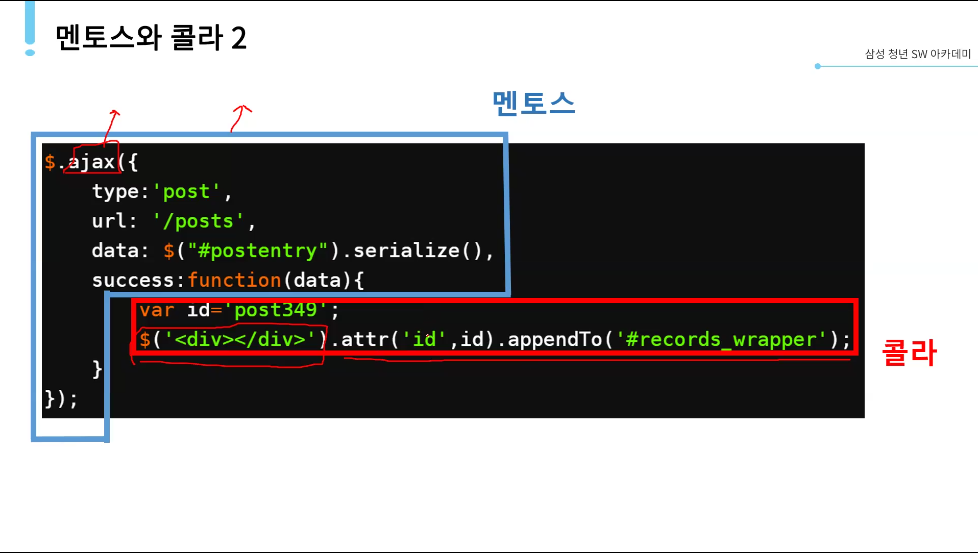
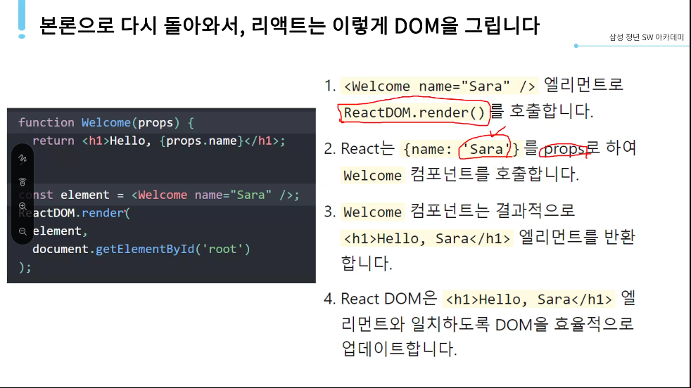

# React Data Flow의 이해

## Redux

Redux를 만든 이유:

많은 상태를 관리할 필요

상태를 언제, 왜, 어떻게 업데이트할지 제어할 수 없는 지경에 이르고 만다

복잡함은 상태 변화(mutation)와 비동기(asynchronocity)와 같이 인간이 추론하기 어려운 두 가지 개념을 섞어서 사용하는 것에서 온다

이 두 가지는 **멘토스와 콜라**...?

async/await를 쓰더라도 멘토스와 콜라인 것은 마찬가지임

데이터를 사용하는 컴포넌트가 하나라면 props를 쓰면 된다.

하지만 데이터를 여러 컴포넌트에서 사용한다면?

props 대신 state!

state라는 것을 component들이 공유하면 된다.

state를 컴포넌트들의 공통 조상에 위치시켜서 이것을 참조한다.

상태를 공통 조상에 위치시키는 것을 state 끌어올리기라고 한다.

언제까지 끌어올려야 하나?

state를 사용하는 컴포넌트들의 가장 가까운 공통 조상까지 state를 끌어올려서 사용한다.

새로운 컴포넌트에서 state를 사용한다면?

새로운 컴포넌트와 가장 가까운 공통 조상을 찾는다.

제발 Redux를 도입하자! 조상 찾기 너무 힘들다...

Redux data flow

React components => Action Creators (trigger라고 함)

=> store로 dispatch(action)

=> Reducers(previousState, action)

=> 순수 함수인 리듀서는 연산 결과를 새로운 state형태로 store에 반환함

항상 동일한 연산 결과를 갖게 됨

컴포넌트는 구독 & 연결된 store로부터 새로운 state를 전달받아 view를 업데이트함

Redux를 사용하면 멘토스와 콜라를 분리할 수 있다!

한 번에 이해할 수는 없다...

전체 flow를 한 번 살펴보고 부분에 대한 이해로 넘어가자

Vue.js와 Vuex도 비슷한 구조였다. 조금 더 간단한 정도

처음부터 Redux를 써야 할까?

처음에는 상태를 끌어올리는 것만으로도 해결되지만, 도입을 고민해야 하는 시기가 오게 되어있음.

데이터가 많아지고, 상태가 자주 바뀔수록 상태관리가 복잡해짐.

그 때 도입해서 해결!