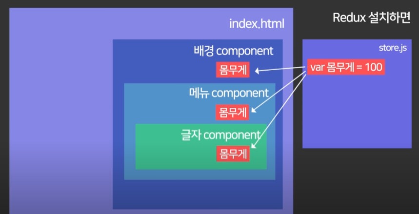

# React-redux

앞서 배운 Redux를 React 프로젝트에서 사용하는 방법을 알아보자.

그러기 위해선 react-redux라는 새로운 것(?)에 대해 알아볼 필요가 있다.


#### Why Redux?

##### props 문법이 매우 복잡해질 때

부모 컴포넌트에서 자식 컴포넌트로 데이터를 전달할 때 props를 이용하여 전달한다.

그런데, 부모 밑의 자식이 부모가 되어 자식 컴포넌트가 생길 경우가 있다. 최상위 부모 컴포넌트에서 최하위 자식 컴포넌트로 데이터를 전달하려면 한 번에 전달하지는 못하고, props를 단계마다 거쳐서 내려가야 한다.

그렇다면 컴포넌트가 100개, 1,000개...훨씬 많아진다면...?

그럴 때 Redux 라이브러리를 이용하면 해결된다!

Redux를 설치하면 state를 보관하는 파일을 만들 수 있다. 예컨대 Store.js라고 하자.

그곳에 state들을 전부 보관한 뒤, 컴포넌트들이 store.js에서 필요한 state를 꺼내서 사용하면 된다.



코드로 구현해 보면 다음과 같다.

우선, 설치법은 다음과 같다

```
npm install react-redux redux
```

그다음, index.js에 state를 저장하겠다(위에서 말한 store.js의 개념)

```
// index.js
import { Provider } from 'react-redux'
import { createStore } from 'redux'

const 체중 = 100;

function reducer (state = 체중, action) {
  return state
}

let store = createStore(reducer)

ReactDOM.render(
  <React.StrictMode>
    <Provider store={store}>
      <App />
    </Provider>
  </React.StrictMode>,
  document.getElementById('root')
)
```

그 뒤 App.js에 컴포넌트를 만들어준다.

```
import { useSelector } from 'react-redux'

function App() {
  const 꺼내온거 = useSelector((state) => state)
  return (
    <div className="App">
      <p>몸무게: {꺼내온거}</p>
    </div>
  )
}

export default App
```


##### 상태(state) 변경 관리할 때

상태 관리?

컴포넌트들이 state를 변경하기 시작할 때, state에 이상이 생기면 무수히 많은 컴포넌트들을 조사해야 한다...

그러지 말고, Redux를 이용해서 store.js에 state 수정방법을 모두 작성해 놓는다.

컴포넌트들은 store에 state의 변경을 요청만 하게 된다.

이렇게 하면 state에 이상이 생겼을 때 store에서만 확인하면 되므로 추적이 용이하다.

위의 index.js에 체중 state를 수정할 방법을 작성해보자. reducer 함수 내부에 작성하면 된다.

```
...
function reducer(state = 체중, action) {
  if (action.type === '증가') {
    state++
    return state
  } else if (action.type === '감소') {
    state--
    return state
  } else {
    return state
  }
}
```

if문으로 해도 되고, switch-case문을 사용해도 된다.

이제 컴포넌트에서 state 수정을 요청하면 되는데 dispatch()를 사용하면 된다.

```
// App.js
import { useSelector, useDispatch } from 'react-redux'

function App() {
  const 꺼내온거 = useSelector((state) => state)
  const dispatch = useDispatch()
  
  return (
    <div className="App">
      <p>몸무게: {꺼내온거}</p>
      <button onClick={() => {dispatch({type: '증가'})}}>더하기</button>
    </div>
  )
}
export default App
```

dispatch의 인자로 type이 들어있는 object를 넣으면 요청이 완료된다.

