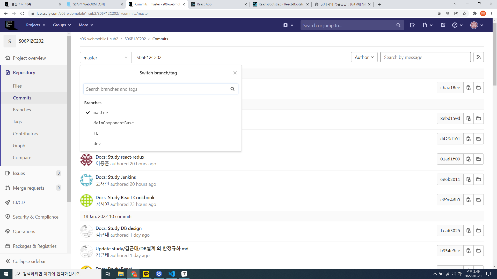
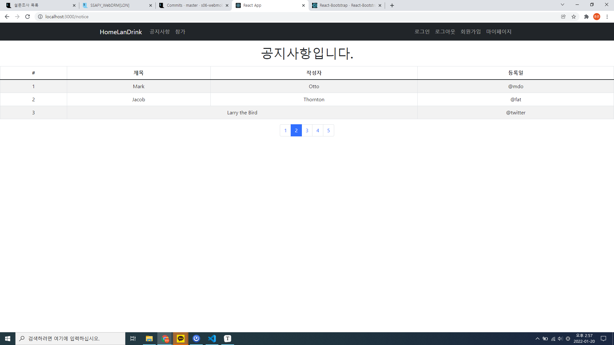

# 0120 개발일지

## 1. 브랜치 생성

프론트엔드 파트는 오늘부터 구현에 들어가기로 했다. 목표는 금요일까지 라우터와 컴포넌트들 대략적으로 구현하기!

그 전에 일단 브랜치를 생성하기로 했다.

브랜치는 master -> dev -> FE 로 만들기로 했다. 백엔드 파트는 master -> dev -> BE가 되지 않을까 예상해본다.

브랜치는 만드는 방법은, 

```
git branch dev
git checkout dev
git push --set-upstream origin dev
```

dev 브랜치를 예로 들어서, 이런 식으로 만들었다.

```
git push -u origin dev
```

이런 식으로 줄여서도 실행이 된다고 한다.



이런 식으로 브랜치들을 생성 완료했다.

다음, 내 로컬 저장소에 pull을 한 뒤, 브랜치를 FE로 바꿔주었다.

방법은,

```
# git remote 갱신하기 => 원격 브랜치에 접근하기 위함
git remote update

# 원격 저장소 branch 확인
git branch -r

# 원하는 원격 저장소의 branch 가져오기
git checkout FE
```

그러면 이제 FE에서 작업을 할 수 있게 되었다.

추가적으로 브랜치들을 더 만들어서(예를 들어 기능별로) 작업할 수 있을 것 같았다. 오늘은 우선 FE에서 작업을 했다.


## 2. 공지사항 뼈대 만들기

https://flykimjiwon.github.io

우리 팀 김지원님이 미리 대략적인 라우터와 컴포넌트들을 구성해 주었다.

오늘은 각자 이것을 토대로 이것저것 시도해보기로 했고, 그 중에서 공지사항의 기본적인 뼈대만 만들어보기로 했다.

react-bootstrap을 이용해서 공지사항의 테이블 형태와 페이지네이션을 삽입해 보았다.



매우 허접하지만, 공지사항의 틀은 만들어졌다.

React-bootstrap은 다음과 같이 사용할 수 있다.

설치:

```
npm install react-bootstrap bootstrap@5.1.3
```

그 다음 부트스트랩에 내장되어있는 컴포넌트를 사용하려면 import를 해야 한다.

위에 사용한 테이블과 페이지네이션을 예로 들면,

```
import { Table, Pagination } from 'react-bootstrap';

function Notice() {
  // 페이지네이션 사용 위한 변수 선언
  let active = 2;
  let items = [];
  for (let number = 1; number <= 5; number++) {
    items.push(
      <Pagination.Item key={number} active={number === active}>
        {number}
      </Pagination.Item>,
    );
  }
  return (
    <div className="mt-3">
      <h1>공지사항입니다.</h1>
      // 테이블
      <Table className="my-3" striped bordered hover>
        <thead>
          <tr>
            <th>#</th>
            <th>제목</th>
            <th>작성자</th>
            <th>등록일</th>
          </tr>
        </thead>
        <tbody>
          <tr>
            <td>1</td>
            <td>Mark</td>
            <td>Otto</td>
            <td>@mdo</td>
          </tr>
          <tr>
            <td>2</td>
            <td>Jacob</td>
            <td>Thornton</td>
            <td>@fat</td>
          </tr>
          <tr>
            <td>3</td>
            <td colSpan={2}>Larry the Bird</td>
            <td>@twitter</td>
          </tr>
        </tbody>
      </Table>
      // 페이지네이션
      <Pagination>{items}</Pagination>
    </div>
  )
}

export default Notice
```

페이지네이션을 가운데정렬하기 위해 Notice.css를 사용했다.

크롬의 개발자 도구로 확인해본 결과, Pagination은 ul과 li로 구성된, pagination이라는 이름의 클래스로 만들어진 컴포넌트였고, flexbox로 구성되어 있었다.

그래서 가운데 정렬을 위해

```
.pagination {
  justify-content: center;
}
```

justify-content를 center로 설정했다.